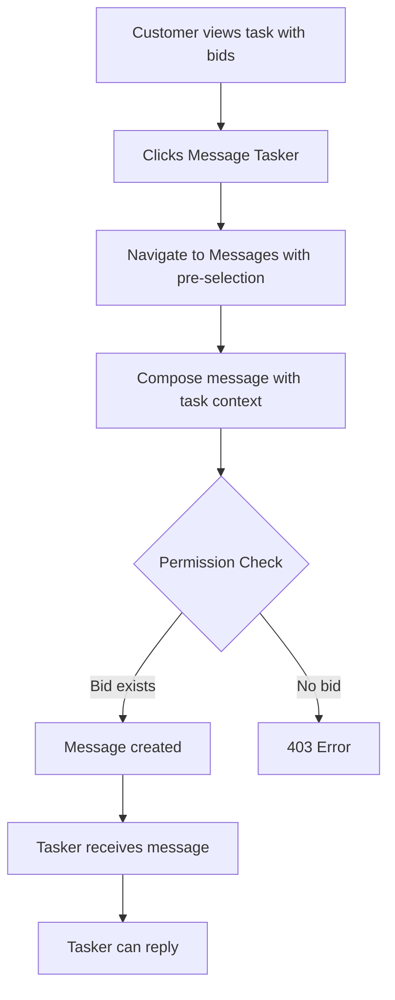

# Title: v0.0.1-3-1-1 - End-to-End Bid-Based Messaging Integration

## Summary: 
Integrate all bid-based messaging components to create a complete workflow where customers and taskers can message each other based on bid relationships, from initial contact through bid acceptance.

### Acceptance Criteria:
- [ ] Customer can click "Message Tasker" on bid card and initiate conversation
- [ ] Task context automatically associated with messages from bid cards
- [ ] Tasker who placed bid can message customer about that task
- [ ] Permission validation prevents messaging without valid bid
- [ ] Message history preserved even if bid is withdrawn or rejected
- [ ] Integration tests verify complete bid→message→response flow
- [ ] Error messages guide users when messaging not allowed
- [ ] Works for multiple bids from same tasker on different tasks

### Test Strategy:

**Integration Tests (End-to-End):**
- Complete workflow: Place bid → Message customer → Customer responds
- Customer initiates: View bids → Click Message Tasker → Send message
- Permission validation: Tasker without bid cannot message about task
- Multiple bids: Same tasker, different tasks create separate conversations
- Bid withdrawal: Messages remain accessible after bid withdrawal

**Tools:** pytest, FastAPI TestClient, test database fixtures
**Coverage Target:** >85%

---

## 📝 Code Changes

**Description:**
This issue integrates existing components (permission validation, task context, Message Tasker button) to create the complete bid-based messaging workflow. No new code should be required - this is primarily integration and testing.

**Validation Flow:**

**Integration Points:**
1. TaskDetail component → Message Tasker button (v0.0.1-2-2-1)
2. Messages component → Pre-selected conversation (v0.0.1-2-1-2)
3. POST /messages → Permission validation (v0.0.1-1-1-2)
4. Message creation → Task context (v0.0.1-1-2-1)

---

## Issue Dependencies

**Depends on:**
- v0.0.1-1-1-1 - Create Permission Validation Function
- v0.0.1-1-1-2 - Integrate Permission Validation into Message Endpoint
- v0.0.1-1-2-1 - Add Task Context to Message Creation
- v0.0.1-2-2-1 - Message Tasker Button Integration
- v0.0.1-2-1-2 - Update Messages Component to Display User Details

## Related Issues

- v0.0.1-3-2-1 - Offer-Based Messaging Integration
- v0.0.1-3-3-1 - Agreement-Based Messaging Integration