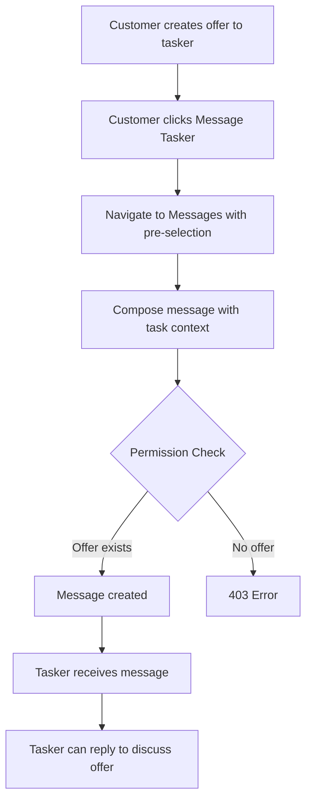

# Title: v0.0.1-3-2-1 - End-to-End Offer-Based Messaging Integration

## Summary: 
Integrate all offer-based messaging components to create a complete workflow where customers and taskers can message each other based on offer relationships, from offer creation through offer response.

### Acceptance Criteria:
- [ ] Customer can click "Message Tasker" on offer card and initiate conversation
- [ ] Task context automatically associated with messages from offer cards
- [ ] Tasker who received offer can message customer about that offer
- [ ] Permission validation prevents messaging without valid offer
- [ ] Message history preserved even if offer is declined
- [ ] Integration tests verify complete offer→message→response flow
- [ ] Error messages guide users when messaging not allowed
- [ ] Works for multiple offers to different taskers on same task

### Test Strategy:

**Integration Tests (End-to-End):**
- Complete workflow: Send offer → Message tasker → Tasker responds
- Customer initiates: View offers → Click Message Tasker → Send message
- Tasker initiates: Receive offer → Message customer → Discuss terms
- Permission validation: Tasker without offer cannot message
- Multiple offers: Same task, different taskers create separate conversations
- Offer decline: Messages remain accessible after offer declined

**Tools:** pytest, FastAPI TestClient, test database fixtures
**Coverage Target:** >85%

---

## 📝 Code Changes

**Description:**
This issue integrates existing components for offer-based messaging. The permission validation already checks for offers, so this is primarily integration testing and documentation.

**Validation Flow:**

**Integration Points:**
1. TaskDetail component → Message Tasker button on offer cards (v0.0.1-2-2-1)
2. Messages component → Pre-selected conversation (v0.0.1-2-1-2)
3. POST /messages → Permission validation checks offers (v0.0.1-1-1-2)
4. Message creation → Task context (v0.0.1-1-2-1)

---

## Issue Dependencies

**Depends on:**
- v0.0.1-1-1-1 - Create Permission Validation Function
- v0.0.1-1-1-2 - Integrate Permission Validation into Message Endpoint
- v0.0.1-1-2-1 - Add Task Context to Message Creation
- v0.0.1-2-2-1 - Message Tasker Button Integration
- v0.0.1-2-1-2 - Update Messages Component to Display User Details

## Related Issues

- v0.0.1-3-1-1 - Bid-Based Messaging Integration
- v0.0.1-3-3-1 - Agreement-Based Messaging Integration