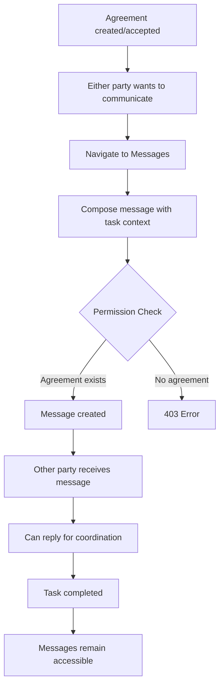

# Title: v0.0.1-3-3-1 - End-to-End Agreement-Based Messaging Integration

## Summary: 
Integrate agreement-based messaging to enable ongoing communication between customers and taskers throughout task execution, from agreement creation through completion and beyond.

### Acceptance Criteria:
- [ ] Customer can message tasker once agreement is created
- [ ] Tasker can message customer once agreement is accepted
- [ ] Messaging works for all agreement statuses (pending, accepted, completed)
- [ ] Task context automatically associated with agreement messages
- [ ] Message history persists after agreement completion
- [ ] Integration tests verify complete agreement→message→completion flow
- [ ] Quick access to messaging from dashboard for active agreements
- [ ] Works correctly with permission validation

### Test Strategy:

**Integration Tests (End-to-End):**
- Complete workflow: Create agreement → Exchange messages → Complete task → Messages still accessible
- Agreement status: Test messaging works for pending, accepted, and completed agreements
- Both parties: Both customer and tasker can initiate and respond
- Permission validation: Only agreement parties can message
- Post-completion: Messages remain accessible after task completion

**Tools:** pytest, FastAPI TestClient, test database fixtures
**Coverage Target:** >85%

---

## 📝 Code Changes

**Description:**
This issue integrates existing agreement-based permission validation with the messaging system. The permission validation function already checks for agreements, so this focuses on integration and testing.

**Validation Flow:**

**Integration Points:**
1. Dashboard components → Quick message button for active agreements
2. Messages component → Agreement-based conversations
3. POST /messages → Permission validation checks agreements (v0.0.1-1-1-2)
4. Message creation → Task context (v0.0.1-1-2-1)

**Optional Enhancement:**
Add "Message Customer/Tasker" button to agreement cards in dashboards for quick access.

---

## Issue Dependencies

**Depends on:**
- v0.0.1-1-1-1 - Create Permission Validation Function
- v0.0.1-1-1-2 - Integrate Permission Validation into Message Endpoint
- v0.0.1-1-2-1 - Add Task Context to Message Creation
- v0.0.1-2-1-2 - Update Messages Component to Display User Details

## Related Issues

- v0.0.1-3-1-1 - Bid-Based Messaging Integration
- v0.0.1-3-2-1 - Offer-Based Messaging Integration