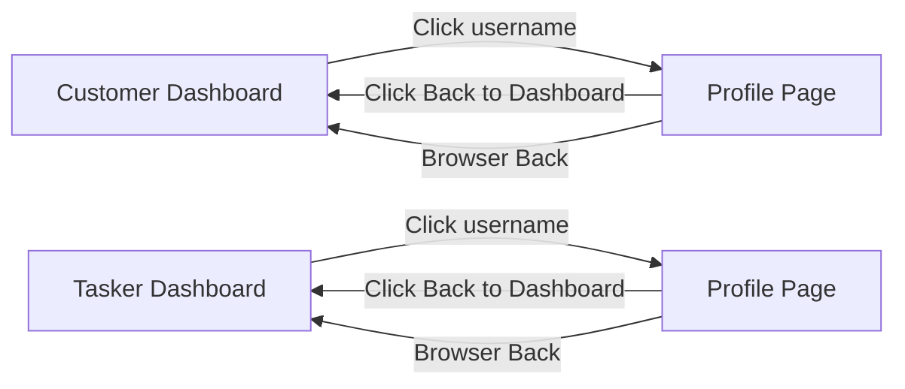

# Title: v0.0.2-3-1-1 - Add Dashboard Navigation Button to Profile Page

## Summary: 
Add a "Back to Dashboard" navigation button to the Profile component that intelligently routes users to their role-specific dashboard (customer-dashboard or tasker-dashboard). This ensures users can easily return to their workflow without getting stuck on the profile page.

### Acceptance Criteria:
- [ ] "Back to Dashboard" button/link added to Profile component
- [ ] Navigation logic determines correct dashboard based on `user.role` value
- [ ] Button uses React Router Link or useNavigate for client-side navigation
- [ ] Button placement is intuitive and user-friendly (top of page recommended)
- [ ] Button styling matches application design system
- [ ] Customer users navigate to `/customer-dashboard` when clicking button
- [ ] Tasker users navigate to `/tasker-dashboard` when clicking button
- [ ] Browser back button continues to work correctly with React Router
- [ ] Button is keyboard accessible (can be tabbed to and activated with Enter)
- [ ] Navigation maintains authentication state (no session disruption)
- [ ] Icon or arrow (←) included for visual clarity

### Test Strategy:

**Manual Testing:**
- Test navigation as customer user (should go to customer-dashboard)
- Test navigation as tasker user (should go to tasker-dashboard)
- Test keyboard navigation (Tab to button, Enter to activate)
- Test browser back button after using dashboard button
- Test button appearance and hover state
- Test on mobile devices (touch interaction)

**User Roles:**
- Customer profile → customer-dashboard navigation
- Tasker profile → tasker-dashboard navigation

**Browser Testing:**
- Chrome/Edge (latest)
- Firefox (latest)
- Safari (latest)

**Accessibility:**
- Keyboard navigation (Tab, Enter)
- Screen reader announcement
- Focus indicator visibility

---

## 📝 Code Changes

**Description:**
Add a "Back to Dashboard" navigation button at the top of the Profile component. The button uses conditional logic to determine the appropriate dashboard route based on the user's role.

**File:** `app/frontend/src/components/Profile.js`

**Implementation Approach 1: Using Link Component**

```diff
  import React, { useState, useEffect } from 'react';
+ import { Link } from 'react-router-dom';
  import { getCurrentUser } from '../api';

  function Profile() {
    const [user, setUser] = useState(null);
    const [loading, setLoading] = useState(true);
    const [error, setError] = useState(null);

    useEffect(() => {
      const fetchProfile = async () => {
        try {
          const userData = await getCurrentUser();
          setUser(userData);
        } catch (err) {
          setError('Failed to load profile. Please try again.');
          console.error('Profile fetch error:', err);
        } finally {
          setLoading(false);
        }
      };
      fetchProfile();
    }, []);

    // ... existing helper functions ...

    if (loading) {
      return (
        <div className="profile-container">
          <div className="loading-message">Loading profile...</div>
        </div>
      );
    }

    if (error) {
      return (
        <div className="profile-container">
          <div className="error-message">{error}</div>
        </div>
      );
    }

    if (!user) {
      return (
        <div className="profile-container">
          <div className="error-message">No profile data available</div>
        </div>
      );
    }

+   // Determine dashboard path based on user role
+   const dashboardPath = user.role === 'customer' 
+     ? '/customer-dashboard' 
+     : '/tasker-dashboard';

    return (
      <div className="profile-container">
+       <Link to={dashboardPath} className="back-to-dashboard-btn">
+         ← Back to Dashboard
+       </Link>
+       
        <h2>My Profile</h2>
        
        <div className="profile-section">
          <h3>Account Information</h3>
          {/* ... existing account fields ... */}
        </div>
        
        {user.role === 'tasker' && (
          <div className="profile-section">
            <h3>Professional Information</h3>
            {/* ... existing professional fields ... */}
          </div>
        )}
      </div>
    );
  }

  export default Profile;
```

**Implementation Approach 2: Using useNavigate Hook (Alternative)**

```jsx
import { useNavigate } from 'react-router-dom';

function Profile() {
  const navigate = useNavigate();
  // ... existing code ...
  
  const handleBackToDashboard = () => {
    const dashboardPath = user.role === 'customer' 
      ? '/customer-dashboard' 
      : '/tasker-dashboard';
    navigate(dashboardPath);
  };
  
  return (
    <div className="profile-container">
      <button onClick={handleBackToDashboard} className="back-to-dashboard-btn">
        ← Back to Dashboard
      </button>
      {/* ... rest of component ... */}
    </div>
  );
}
```

**Recommended:** Use Link component (Approach 1) for better accessibility and standard navigation behavior.

---

## 📝 Code Changes

**Description:**
Add CSS styling for the "Back to Dashboard" button to match the application's design system with proper hover states and accessibility features.

**File:** `app/frontend/src/index.css`

```css
/* Back to Dashboard Button */
.back-to-dashboard-btn {
  display: inline-block;
  padding: 10px 20px;
  background-color: #007bff;
  color: white;
  text-decoration: none;
  border-radius: 5px;
  margin-bottom: 20px;
  cursor: pointer;
  border: none;
  font-size: 14px;
  font-weight: 500;
  transition: background-color 0.2s ease, transform 0.1s ease;
  box-shadow: 0 2px 4px rgba(0, 123, 255, 0.2);
}

.back-to-dashboard-btn:hover {
  background-color: #0056b3;
  text-decoration: none;
  transform: translateY(-1px);
  box-shadow: 0 4px 6px rgba(0, 123, 255, 0.3);
}

.back-to-dashboard-btn:active {
  transform: translateY(0);
  box-shadow: 0 2px 4px rgba(0, 123, 255, 0.2);
}

.back-to-dashboard-btn:focus {
  outline: 2px solid #0056b3;
  outline-offset: 2px;
}

/* Mobile optimization */
@media (max-width: 768px) {
  .back-to-dashboard-btn {
    width: 100%;
    text-align: center;
    margin-bottom: 15px;
  }
}
```

---

## 🖥️ Front End Components (If Applicable)

**Component Enhancement:** Profile.js

**Description:**
The Profile component is enhanced with a navigation button positioned at the top of the page. The button's destination is dynamically determined based on the logged-in user's role, providing seamless navigation back to the appropriate dashboard.

**Visual Structure:**
```
┌─────────────────────────────────────┐
│ [← Back to Dashboard]               │  ← New navigation button
│                                     │
│ My Profile                          │
│ ═════════════════════════           │
│                                     │
│ Account Information                 │
│ ┌─────────────────────────────────┐│
│ │ Full Name:    John Doe          ││
│ │ Email:        john@example.com  ││
│ │ ...                             ││
│ └─────────────────────────────────┘│
│                                     │
│ Professional Information (if tasker)│
│ ┌─────────────────────────────────┐│
│ │ Skills:       Plumbing          ││
│ │ ...                             ││
│ └─────────────────────────────────┘│
└─────────────────────────────────────┘
```

**User Interaction Flow:**



---

## 📦 Dependencies (If Applicable)

**Package Manager:** `npm`

No new dependencies required. Uses existing `react-router-dom` Link component.

**Required Import:**
- `Link` from `react-router-dom` (already installed and used in navbar)

---

## Issue Dependencies

**Depends on:**
- v0.0.2-2-1-1 - Customer Profile View Component (requires profile page to exist)

**Blocks:**
- None (this is an independent enhancement to improve UX)

## Related Issues

- v0.0.2-1-1-1 - Make Username Clickable for Profile Navigation (provides entry to profile)
- v0.0.2-2-1-1 - Customer Profile View Component (base component)
- v0.0.2-2-2-1 - Tasker Profile View with Professional Details (complete profile)