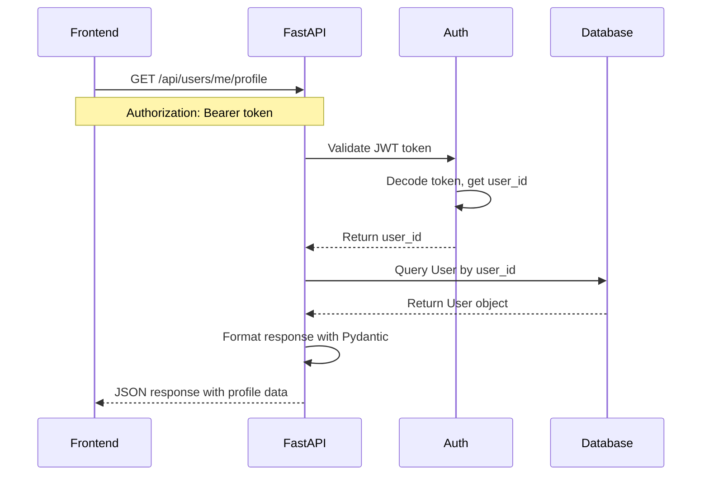
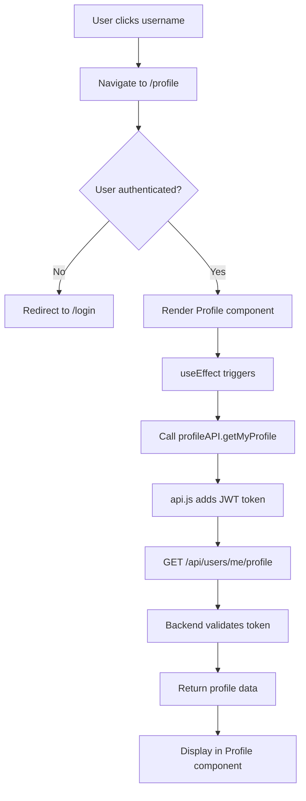
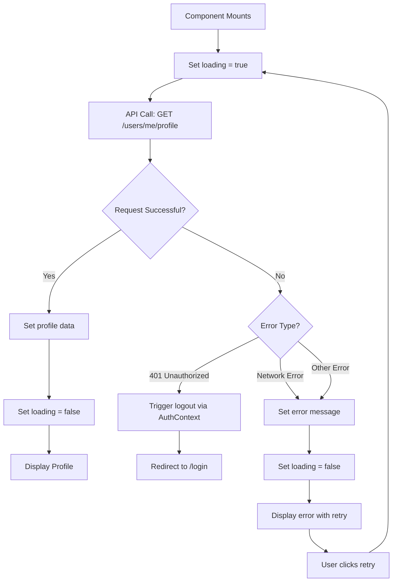

# v0.0.1 User Profile - Self View - User Stories

## Overview

This document contains detailed user stories for the User Profile Self-View feature (v0.0.1). The feature enables logged-in users to access and view their own profile information by clicking their username in the navigation bar. This document is designed to guide development teams through implementation, ensuring all functional and technical requirements are met while maintaining consistency with the existing Tasker Marketplace platform architecture.

The stories are organized into a single epic with granular implementation tasks that can be developed sequentially or in parallel where dependencies allow.

---

## Story Summary

| Story ID | Epic | Title | Story Points | Priority |
| :--- | :--- | :--- | :--- | :--- |
| v0.0.1-1-1 | User Profile - Self View | Backend API Endpoint for User Profile | 5 | High |
| v0.0.1-1-2 | User Profile - Self View | Make Navigation Username Clickable | 2 | High |
| v0.0.1-1-3 | User Profile - Self View | Create Profile Page Component | 5 | High |
| v0.0.1-1-4 | User Profile - Self View | Add Profile Route and Integration | 3 | High |
| v0.0.1-1-5 | User Profile - Self View | Conditional Tasker Fields Display | 3 | Medium |
| v0.0.1-1-6 | User Profile - Self View | Error Handling and Loading States | 2 | Medium |

---

## Epic 1: User Profile - Self View

### Story v0.0.1-1-1: Backend API Endpoint for User Profile

**User Story:**
As a backend developer  
I want to create a secure API endpoint that returns complete user profile data  
So that the frontend can display all required user information including tasker-specific fields

**Acceptance Criteria (Gherkin Format):**
**Given** a logged-in user with a valid JWT token  
**When** they make a GET request to `/api/users/me/profile`  
**Then** the API should return their complete profile data in JSON format  
**And** the response should include all user fields from the User model  
**And** tasker-specific fields should be included only for tasker-type users  
**And** the endpoint should require valid authentication  
**And** unauthorized requests should return 401 status

**Detailed Acceptance Criteria:**
- Endpoint path must be `/api/users/me/profile` using GET method
- Authentication required via JWT token in Authorization header
- Response must include: id, username, email, user_type, created_at
- For taskers, response must also include: skills, hourly_rate
- Response format must follow existing Pydantic schema patterns
- Endpoint must use dependency injection for database session
- Must handle database errors gracefully with appropriate HTTP status codes
- Must validate token and retrieve user from database using user_id from token
- Response time must be under 200ms (excluding network latency)
- Endpoint must be documented in FastAPI's automatic OpenAPI/Swagger docs

**API Response Schema:**

```json
{
  "id": 1,
  "username": "johndoe",
  "email": "john@example.com",
  "user_type": "tasker",
  "created_at": "2024-01-15T10:30:00Z",
  "skills": "Plumbing, Electrical Work",
  "hourly_rate": 45.00
}
```

**Data Flow Diagram:**



**Definition of Done:**
- [ ] Endpoint implemented in [`backend/main.py`](backend/main.py:1) following existing route patterns
- [ ] Pydantic response schema created in [`backend/schemas.py`](backend/schemas.py:1) as `UserProfileResponse`
- [ ] JWT authentication dependency applied using existing `get_current_user` function from [`backend/auth.py`](backend/auth.py:1)
- [ ] Database query uses SQLAlchemy ORM with proper session management
- [ ] Error handling implemented for invalid tokens, user not found, and database errors
- [ ] Unit tests written covering success case, authentication failure, and user not found scenarios
- [ ] Test coverage >90% for the new endpoint code
- [ ] OpenAPI documentation automatically generated and verified
- [ ] Response time measured and confirmed <200ms
- [ ] Code reviewed and approved by at least one peer
- [ ] Deployed to staging environment and passing integration tests

---

### Story v0.0.1-1-2: Make Navigation Username Clickable

**User Story:**
As a logged-in user  
I want to click on my username in the navigation bar  
So that I can navigate to my profile page

**Acceptance Criteria (Gherkin Format):**
**Given** I am logged in and viewing any page  
**When** I look at the navigation bar  
**Then** I should see my username displayed  
**And** the username should appear as a clickable link  
**And** when I click my username  
**Then** I should be navigated to the `/profile` route  
**And** the link should have appropriate styling to indicate it is clickable

**Detailed Acceptance Criteria:**
- Username display in [`Navigation.jsx`](frontend/src/components/Navigation.jsx:30) must be converted from `<span>` to React Router `<Link>` component
- Link must navigate to `/profile` route
- Visual styling must indicate the username is clickable (e.g., cursor pointer, hover state)
- Link styling should be consistent with other navigation links
- Accessibility: link must have appropriate ARIA labels
- Username should remain right-aligned in the navigation bar
- Clicking external to the username should not trigger navigation
- Navigation must work from any page in the application
- Browser back button should work correctly after navigating to profile

**Component Changes:**

```jsx
// Before (line 30-32 in Navigation.jsx)
<span style={{ marginLeft: 'auto' }}>
  Welcome, {user.username}
</span>

// After
<Link 
  to="/profile" 
  style={{ marginLeft: 'auto', cursor: 'pointer' }}
  className="username-link"
  aria-label="View my profile"
>
  Welcome, {user.username}
</Link>
```

**Definition of Done:**
- [ ] Navigation component updated to use React Router `<Link>` component
- [ ] Import statement added for Link from react-router-dom
- [ ] CSS styling applied for clickable appearance (hover state, cursor)
- [ ] Manual testing confirmed on all existing pages
- [ ] Accessibility verified with screen reader
- [ ] Cross-browser testing completed (Chrome, Firefox, Safari, Edge)
- [ ] Mobile responsive behavior verified
- [ ] No console errors or warnings
- [ ] Code reviewed and approved
- [ ] Changes deployed to staging and verified

---

### Story v0.0.1-1-3: Create Profile Page Component

**User Story:**
As a logged-in user  
I want to see a dedicated profile page displaying my account information  
So that I can review my username, email, account type, join date, and tasker-specific details

**Acceptance Criteria (Gherkin Format):**
**Given** I navigate to the `/profile` route while logged in  
**When** the Profile page loads  
**Then** I should see my username displayed prominently  
**And** I should see my email address  
**And** I should see my account type (Customer or Tasker)  
**And** I should see my account creation date in a readable format  
**And** if I am a tasker, I should see my skills and hourly rate  
**And** if I am a customer, tasker-specific fields should not be displayed  
**And** the page styling should match existing pages like Dashboard and TaskList

**Detailed Acceptance Criteria:**
- Component must be created as `Profile.jsx` in [`frontend/src/pages/`](frontend/src/pages/) directory
- Must use React functional component with hooks
- Must fetch user data from `/api/users/me/profile` endpoint using Axios
- Must implement loading state while fetching data
- Must display all required fields with clear labels
- Date formatting must be human-readable (e.g., "January 15, 2024" not ISO string)
- Page must be responsive and work on mobile devices
- Styling must use consistent CSS patterns from [`App.css`](frontend/src/App.css:1)
- Component must handle conditional rendering for tasker vs customer
- Must follow the structure pattern used in other pages (imports, state, effects, render)
- Page must have a clear heading "My Profile" or similar

**Component Structure:**

```jsx
import { useState, useEffect } from 'react';
import { profileAPI } from '../api';
import '../App.css';

export default function Profile() {
  const [profile, setProfile] = useState(null);
  const [loading, setLoading] = useState(true);
  const [error, setError] = useState(null);

  useEffect(() => {
    fetchProfile();
  }, []);

  const fetchProfile = async () => {
    try {
      setLoading(true);
      const response = await profileAPI.getMyProfile();
      setProfile(response.data);
    } catch (err) {
      setError(err.response?.data?.detail || 'Failed to load profile');
    } finally {
      setLoading(false);
    }
  };

  if (loading) return <div>Loading profile...</div>;
  if (error) return <div className="error">{error}</div>;
  if (!profile) return <div>No profile data available</div>;

  return (
    <div className="profile-container">
      <h1>My Profile</h1>
      {/* Profile fields display */}
    </div>
  );
}
```

**Profile Display Layout:**

```
┌─────────────────────────────────────┐
│         My Profile                  │
├─────────────────────────────────────┤
│                                     │
│  Username:     johndoe              │
│  Email:        john@example.com     │
│  Account Type: Tasker               │
│  Member Since: January 15, 2024     │
│                                     │
│  --- Tasker Information ---         │
│  Skills:       Plumbing, Electrical │
│  Hourly Rate:  $45.00              │
│                                     │
└─────────────────────────────────────┘
```

**Definition of Done:**
- [ ] Profile.jsx component created in frontend/src/pages/
- [ ] Component uses functional component pattern with useState and useEffect
- [ ] API integration using Axios from api.js module
- [ ] Loading state implemented with appropriate UI feedback
- [ ] Error state implemented with user-friendly error messages
- [ ] All required fields displayed with proper formatting
- [ ] Date formatting implemented using JavaScript Date methods or library
- [ ] Conditional rendering for tasker-specific fields implemented
- [ ] CSS styling applied following existing patterns
- [ ] Responsive design verified on mobile and desktop
- [ ] Manual testing on all user types (customer and tasker accounts)
- [ ] Code reviewed and approved
- [ ] Component deployed and tested in staging environment

---

### Story v0.0.1-1-4: Add Profile Route and Integration

**User Story:**
As a developer  
I want to integrate the Profile component into the application routing  
So that users can access the profile page via the `/profile` route

**Acceptance Criteria (Gherkin Format):**
**Given** the Profile component is implemented  
**When** a user navigates to `/profile`  
**Then** the Profile component should render  
**And** the route should be protected (require authentication)  
**And** unauthenticated users should be redirected to login  
**And** the API client should include the profile endpoint  
**And** the profile endpoint should use proper authentication headers

**Detailed Acceptance Criteria:**
- Route must be added to [`App.jsx`](frontend/src/App.jsx:1) following existing route patterns
- Route must use `PrivateRoute` component to ensure authentication
- Profile component must be imported and rendered for `/profile` path
- API client in [`api.js`](frontend/src/api.js:1) must include `getMyProfile()` function
- API function must use GET method to `/api/users/me/profile`
- API client must automatically include JWT token in Authorization header
- Route must be accessible from any authenticated page
- Navigation must maintain state (no loss of data when navigating to/from profile)
- Browser refresh on `/profile` route should maintain authentication and show profile

**Route Configuration:**

```jsx
// In App.jsx
import Profile from './pages/Profile';

// Add within Routes component
<Route 
  path="/profile" 
  element={
    <PrivateRoute>
      <Profile />
    </PrivateRoute>
  } 
/>
```

**API Integration:**

```javascript
// In api.js
export const profileAPI = {
  getMyProfile: () => api.get('/users/me/profile'),
};
```

**Integration Flow:**



**Definition of Done:**
- [ ] Route added to App.jsx with PrivateRoute protection
- [ ] Profile component imported in App.jsx
- [ ] profileAPI object created in api.js with getMyProfile method
- [ ] API endpoint path matches backend implementation
- [ ] JWT token automatically included via Axios interceptor
- [ ] Route tested with authenticated user - successful navigation
- [ ] Route tested with unauthenticated user - redirects to login
- [ ] Browser refresh testing completed
- [ ] Navigation state preservation verified
- [ ] Integration testing passed in staging environment
- [ ] Code reviewed and approved

---

### Story v0.0.1-1-5: Conditional Tasker Fields Display

**User Story:**
As a tasker  
I want to see my skills and hourly rate on my profile  
So that I can verify the information customers see when considering my bids

**As a customer**  
I want to see only my basic account information  
So that I am not shown irrelevant tasker-specific fields

**Acceptance Criteria (Gherkin Format):**
**Given** I am a tasker viewing my profile  
**When** the profile page loads  
**Then** I should see a "Tasker Information" section  
**And** I should see my skills listed  
**And** I should see my hourly rate formatted as currency  

**Given** I am a customer viewing my profile  
**When** the profile page loads  
**Then** I should NOT see the "Tasker Information" section  
**And** I should NOT see skills or hourly rate fields  
**And** the page layout should adjust appropriately

**Detailed Acceptance Criteria:**
- Conditional rendering must check `profile.user_type === 'tasker'`
- Tasker section must have clear visual separation (heading, border, or card)
- Skills must be displayed as formatted text
- Hourly rate must be formatted as USD currency (e.g., "$45.00")
- If tasker has null/empty skills, should display "Not specified"
- If tasker has null hourly rate, should display "Not specified"
- Customer profile should not show empty space where tasker section would be
- Styling must maintain consistent spacing regardless of user type
- Page must re-render correctly if user type changes (edge case)

**Conditional Rendering Implementation:**

```jsx
{profile.user_type === 'tasker' && (
  <div className="tasker-info-section">
    <h2>Tasker Information</h2>
    <div className="profile-field">
      <label>Skills:</label>
      <span>{profile.skills || 'Not specified'}</span>
    </div>
    <div className="profile-field">
      <label>Hourly Rate:</label>
      <span>
        {profile.hourly_rate 
          ? `$${parseFloat(profile.hourly_rate).toFixed(2)}`
          : 'Not specified'
        }
      </span>
    </div>
  </div>
)}
```

**User Type Comparison:**

```
TASKER PROFILE                    CUSTOMER PROFILE
├── My Profile                    ├── My Profile
├── Username: johndoe            ├── Username: janedoe
├── Email: john@example.com      ├── Email: jane@example.com
├── Account Type: Tasker         ├── Account Type: Customer
├── Member Since: Jan 15, 2024   ├── Member Since: Jan 20, 2024
├── --- Tasker Information ---   └── (end of profile)
├── Skills: Plumbing, Electrical
└── Hourly Rate: $45.00
```

**Definition of Done:**
- [ ] Conditional rendering implemented based on user_type field
- [ ] Tasker section displays correctly for tasker users
- [ ] Tasker section hidden completely for customer users
- [ ] Currency formatting implemented for hourly_rate
- [ ] Null/empty value handling for skills and hourly_rate
- [ ] CSS styling applied for tasker information section
- [ ] Visual separation (heading, styling) between basic and tasker info
- [ ] Manual testing with tasker account - fields display correctly
- [ ] Manual testing with customer account - fields hidden correctly
- [ ] Layout spacing verified for both user types
- [ ] Code reviewed and approved
- [ ] Tested in staging environment with both account types

---

### Story v0.0.1-1-6: Error Handling and Loading States

**User Story:**
As a user  
I want to see appropriate feedback when loading my profile or encountering errors  
So that I understand what is happening and can take corrective action if needed

**Acceptance Criteria (Gherkin Format):**
**Given** I navigate to my profile page  
**When** the data is being loaded  
**Then** I should see a loading indicator  
**And** the page should not show empty or undefined data  

**Given** the profile API request fails due to network error  
**When** the error occurs  
**Then** I should see a user-friendly error message  
**And** I should have an option to retry loading the profile  

**Given** my authentication token has expired  
**When** attempting to load the profile  
**Then** I should be redirected to the login page  
**And** I should see a message indicating my session expired

**Detailed Acceptance Criteria:**
- Loading state must be displayed immediately when component mounts
- Loading indicator should be visually centered and clear (spinner or text)
- Minimum loading time should not cause flash of loading state (consider delay)
- Error messages must be user-friendly (not raw error stack traces)
- Error handling must differentiate between network errors and authorization errors
- 401 Unauthorized responses should trigger redirect to login via AuthContext
- Network errors should show "Unable to load profile. Please try again."
- Retry button must be provided for network errors
- Retry button should clear error state and re-attempt API call
- Error messages must use consistent styling from existing error patterns
- Console should log detailed errors for debugging (not shown to user)

**Error Handling Flow:**



**Error State Implementation:**

```jsx
const [error, setError] = useState(null);

const handleRetry = () => {
  setError(null);
  fetchProfile();
};

if (error) {
  return (
    <div className="error-container">
      <p className="error-message">{error}</p>
      <button onClick={handleRetry} className="retry-button">
        Retry
      </button>
    </div>
  );
}
```

**Definition of Done:**
- [ ] Loading state implemented with useState hook
- [ ] Loading indicator component/message displayed during data fetch
- [ ] Try-catch block implemented in fetchProfile function
- [ ] Error state set and displayed for failed requests
- [ ] User-friendly error messages implemented (not technical stack traces)
- [ ] 401 errors handled with redirect to login (integrate with AuthContext)
- [ ] Network errors display "Unable to load profile" message
- [ ] Retry button implemented and functional
- [ ] Retry clears error and re-attempts API call
- [ ] Console.error() used for detailed error logging (debugging)
- [ ] Manual testing of loading state
- [ ] Manual testing of network error scenario (disconnect network)
- [ ] Manual testing of expired token scenario
- [ ] Manual testing of retry functionality
- [ ] Code reviewed and approved
- [ ] All scenarios tested in staging environment

---

## Story Dependencies

### Critical Path
The following stories must be completed in sequence as they have direct dependencies:

1. **v0.0.1-1-1** (Backend API Endpoint) → **v0.0.1-1-4** (Add Profile Route and Integration) → **v0.0.1-1-3** (Create Profile Page Component) → **v0.0.1-1-5** (Conditional Tasker Fields) → **v0.0.1-1-6** (Error Handling)

**Rationale:**
- The backend API must exist before frontend integration can be implemented
- Route and API integration must be configured before the Profile component can fetch data
- The Profile component must be functional before conditional rendering can be added
- Error handling is the final enhancement to ensure robust user experience

### Parallel Development Opportunities

**Backend & Frontend UI Foundation** can be developed in parallel:
- **v0.0.1-1-1** (Backend API Endpoint) can be developed simultaneously with **v0.0.1-1-2** (Make Navigation Username Clickable)
- Backend team can implement and test the API endpoint while frontend team updates the Navigation component
- These have no direct dependencies and can merge independently

**Component Development & Integration** can overlap:
- **v0.0.1-1-3** (Create Profile Page Component) can begin with mock data once **v0.0.1-1-2** is complete
- Profile component UI can be built and styled using sample data while waiting for **v0.0.1-1-4** integration
- Once integration is ready, component can be connected to real API

**Enhancement Stories** can be developed in any order:
- **v0.0.1-1-5** (Conditional Tasker Fields) and **v0.0.1-1-6** (Error Handling) are independent of each other
- Both depend on **v0.0.1-1-3** being complete, but can be implemented in parallel or in either order
- Consider implementing error handling first to ensure robust development experience

**Recommended Sprint Breakdown:**

**Sprint 1 (High Priority - Core Functionality):**
- v0.0.1-1-1: Backend API Endpoint (5 points)
- v0.0.1-1-2: Make Navigation Username Clickable (2 points)
- v0.0.1-1-4: Add Profile Route and Integration (3 points)
- **Total: 10 points**

**Sprint 2 (Component & Enhancements):**
- v0.0.1-1-3: Create Profile Page Component (5 points)
- v0.0.1-1-5: Conditional Tasker Fields Display (3 points)
- v0.0.1-1-6: Error Handling and Loading States (2 points)
- **Total: 10 points**

This breakdown ensures balanced sprints with clear deliverables and allows for early integration testing after Sprint 1.