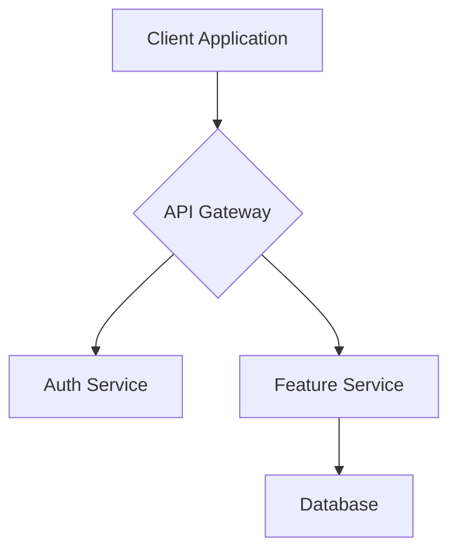
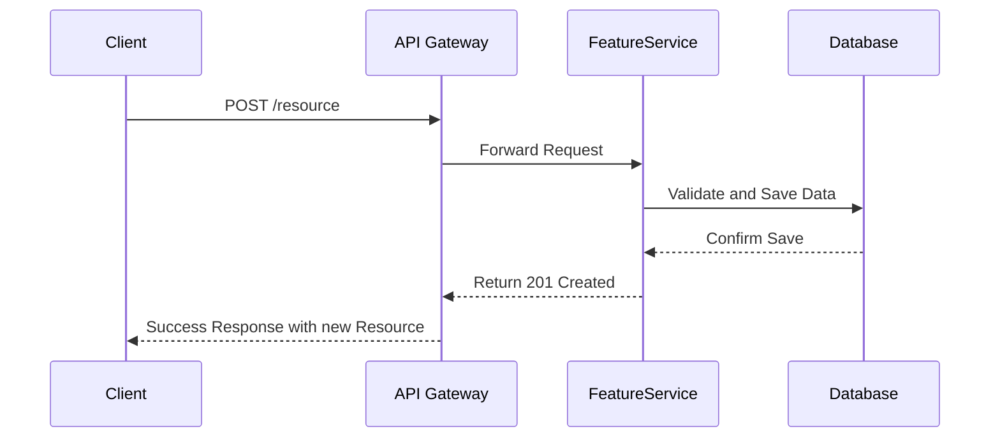

# # [Version] [Feature Name] - Design Document

## Overview

[High-level description of the feature and its place in the overall system. What user problem does it solve? What is the core functionality?]

-----

## Steering Document Alignment

### Technical Standards (tech_stack.md)

[How does this design follow documented technical patterns, coding standards, and best practices?]

### Project Structure (project_structure.md)

[How will the implementation fit into the existing project organization and file structure conventions?]

-----

## Code Reuse Analysis

[What existing code, services, or utilities will be leveraged, extended, or integrated with this feature to avoid reinventing the wheel?]

### Existing Components to Leverage

  - **[Component/Utility Name]**: [Describe how it will be used.]
  - **[Service/Helper Name]**: [Explain how it will be extended or consumed.]

### Integration Points

  - **[Existing System/API]**: [Detail how the new feature will integrate with this system.]
  - **[Database/Storage]**: [Explain how data will connect to existing schemas or tables.]

-----

## Architecture

[Describe the overall architecture and design patterns used (e.g., microservices, event-driven, MVC). Explain the high-level technical approach and why it was chosen.]



-----

## Data Flow

[This section illustrates how data moves through the system for key user actions. Create a diagram for each significant process.]

### Flow 1: [Name of the Process, e.g., "User Submitting New Data"]

[Describe the sequence of events in this flow. For example: "The user submits a form from the client, which sends a request to the backend service to validate and store the data." ]



-----

## API Specifications

[Detail the new or updated API endpoints for this feature. Copy the template below for each endpoint.]

### Endpoint 1: `[HTTP METHOD] /[path]/[to]/[resource]`

  - **Description**: [What this endpoint does. e.g., "Creates a new user profile."]
  - **Request**:
      - **Headers**:
          - `Authorization`: `Bearer [JWT_TOKEN]`
          - `Content-Type`: `application/json`
      - **Path Parameters**:
          - `[paramName]`: ([type], [description])
      - **Body**:
        ```json
        {
          "key": "[type]",
          "anotherKey": "[type]"
        }
        ```
  - **Responses**:
      - **`201 Created`**: Success
        ```json
        {
          "id": "[uuid]",
          "key": "[value]",
          "createdAt": "[timestamp]"
        }
        ```
      - **`400 Bad Request`**: Sent if the request body fails validation.
        ```json
        {
          "error": "Invalid input",
          "details": "[Description of the validation error]"
        }
        ```
      - **`401 Unauthorized`**: Sent if the auth token is missing or invalid.

-----

## Components and Interfaces

[Break down the feature into logical, reusable components.]

### Component 1: [Component Name]

  - **Purpose**: [What this component's single responsibility is.]
  - **Interfaces**: [Public methods, APIs, or props it exposes.]
  - **Dependencies**: [What other components or services it depends on.]
  - **Reuses**: [Existing components/utilities it builds upon.]

### Component 2: [Component Name]

  - **Purpose**: [What this component's single responsibility is.]
  - **Interfaces**: [Public methods, APIs, or props it exposes.]
  - **Dependencies**: [What other components or services it depends on.]
  - **Reuses**: [Existing components/utilities it builds upon.]

-----

## Data Models

[Define the core data structures or database schemas for this feature.]

### Model 1: [Model Name]

```typescript
// Define the structure of Model1 in your preferred format (e.g., TypeScript, SQL)
interface [ModelName] {
  id: string;
  name: string;
  createdAt: Date;
  // [Additional properties as needed]
}
```

### Model 2: [Model Name]

```sql
-- Or define as a SQL table
CREATE TABLE [table_name] (
    id UUID PRIMARY KEY,
    -- [Additional columns as needed]
    created_at TIMESTAMP WITH TIME ZONE DEFAULT CURRENT_TIMESTAMP
);
```

-----

## Error Handling

### Error Scenarios

1.  **Scenario 1**: [Description of a potential failure, e.g., "Database connection fails."]

      - **Handling**: [How the system will recover or respond, e.g., "Retry logic with exponential backoff. After 3 retries, return a 503 Service Unavailable error."]
      - **User Impact**: [What the user sees, e.g., "An error message: 'Unable to save your changes. Please try again later.'"]

2.  **Scenario 2**: [Description of another failure, e.g., "External API is unresponsive."]

      - **Handling**: [e.g., "Timeout after 5 seconds. Cache the request for a later retry. Return a specific error code."]
      - **User Impact**: [e.g., "A notification that the action is pending and will be completed shortly."]

-----

## Testing Strategy

### Unit Testing

  - [Describe the unit testing approach. e.g., "Jest will be used to test individual functions and component logic in isolation."]
  - **Key Components to Test**: [List the most critical or complex components/functions.]

### Integration Testing

  - [Describe the integration testing approach. e.g., "Test the interaction between the FeatureService and the Database using a test database container."]
  - **Key Flows to Test**: [List critical multi-component workflows, e.g., "Test the full API request/response cycle for resource creation."]

### End-to-End Testing

  - [Describe the E2E testing approach. e.g., "Cypress will be used to simulate user journeys in a staging environment."]
  - **User Scenarios to Test**: [List key user stories, e.g., "A user can successfully log in, navigate to the feature page, submit the form, and see their new data displayed."]