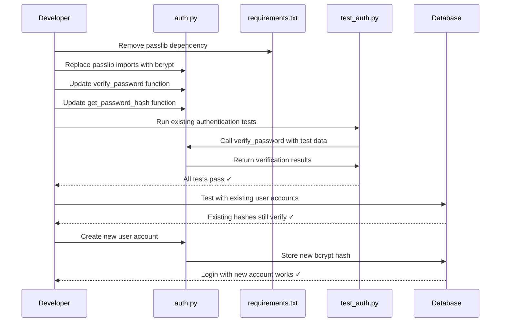

# Title: v0.0.2-2-1-1 - Migrate from passlib to native bcrypt for Python 3.13 Compatibility

## Summary: 
Replace the deprecated `passlib` library with direct `bcrypt` usage to ensure Python 3.13 compatibility. The `passlib` library is causing dependency issues with Python 3.13, and since we already have `bcrypt` 4.3.0 installed, we can use it directly for password hashing and verification. This change removes an unnecessary abstraction layer while maintaining backward compatibility with existing password hashes.

### Acceptance Criteria:
- [ ] `passlib` dependency removed from `requirements.txt`
- [ ] [`auth.py`](backend/auth.py:1) updated to use `bcrypt` directly instead of `passlib.context.CryptContext`
- [ ] All existing password hashes in database continue to work (backward compatibility maintained)
- [ ] New password hashes use the same bcrypt format (starting with `$2b$`)
- [ ] All existing authentication tests pass without modification
- [ ] User registration creates valid password hashes
- [ ] User login validates passwords correctly
- [ ] Password verification works for both old and new hashes

### Test Strategy:

**Required Tools:**
- pytest (already installed)
- Manual testing via API endpoints

**Types of Tests:**
1. **Unit Tests** - Run existing [`test_auth.py`](backend/test_auth.py:1)
2. **Integration Tests** - Test complete authentication flow
3. **Backward Compatibility Tests** - Verify existing hashes still work

**What to Test:**
- Password hashing produces valid bcrypt hashes
- Password verification succeeds for correct passwords
- Password verification fails for incorrect passwords
- Existing user accounts can still log in (if database has existing users)
- New user registration and login flow works end-to-end
- Token generation and validation remain functional

**Test Commands:**
```bash
cd backend
pytest test_auth.py -v
```

---

## 📝 Code Changes

### Background & Rationale
The `passlib` library (v1.7.4) is not compatible with Python 3.13 and is no longer actively maintained. Since we already have `bcrypt` 4.3.0 in our dependencies (which IS Python 3.13 compatible and actively maintained with a Rust-based implementation), we can use it directly. This removes an unnecessary abstraction layer and future-proofs our authentication system.

**Key Points:**
- Existing password hashes remain compatible (bcrypt format is standardized)
- No database migration needed
- Simpler code with fewer dependencies
- Better long-term maintainability

---

**File:** `backend/auth.py`

```diff
:start_line:1
-------
 from datetime import datetime, timedelta
 from typing import Optional
 from jose import JWTError, jwt
-from passlib.context import CryptContext
+import bcrypt
 from fastapi import Depends, HTTPException, status
 from fastapi.security import OAuth2PasswordBearer
 from sqlalchemy.orm import Session
 import models
 from database import get_db
 
 SECRET_KEY = "your-secret-key-here-change-in-production"
 ALGORITHM = "HS256"
 ACCESS_TOKEN_EXPIRE_MINUTES = 30
 
-pwd_context = CryptContext(schemes=["bcrypt"], deprecated="auto")
 oauth2_scheme = OAuth2PasswordBearer(tokenUrl="token")
=======
 from datetime import datetime, timedelta
 from typing import Optional
 from jose import JWTError, jwt
+import bcrypt
 from fastapi import Depends, HTTPException, status
 from fastapi.security import OAuth2PasswordBearer
 from sqlalchemy.orm import Session
 import models
 from database import get_db
 
 SECRET_KEY = "your-secret-key-here-change-in-production"
 ALGORITHM = "HS256"
 ACCESS_TOKEN_EXPIRE_MINUTES = 30
 
 oauth2_scheme = OAuth2PasswordBearer(tokenUrl="token")
>>>>>>> REPLACE
```

```diff
:start_line:18
-------
 def verify_password(plain_password, hashed_password):
-    return pwd_context.verify(plain_password, hashed_password)
+    """
+    Verify a plaintext password against a bcrypt hash.
+    
+    Args:
+        plain_password: The plaintext password to verify
+        hashed_password: The bcrypt hash to verify against
+    
+    Returns:
+        bool: True if password matches, False otherwise
+    """
+    return bcrypt.checkpw(
+        plain_password.encode('utf-8'),
+        hashed_password.encode('utf-8')
+    )
=======
 def verify_password(plain_password, hashed_password):
+    """
+    Verify a plaintext password against a bcrypt hash.
+    
+    Args:
+        plain_password: The plaintext password to verify
+        hashed_password: The bcrypt hash to verify against
+    
+    Returns:
+        bool: True if password matches, False otherwise
+    """
+    return bcrypt.checkpw(
+        plain_password.encode('utf-8'),
+        hashed_password.encode('utf-8')
+    )
>>>>>>> REPLACE
```

```diff
:start_line:21
-------
 def get_password_hash(password):
-    return pwd_context.hash(password)
+    """
+    Hash a plaintext password using bcrypt.
+    
+    Args:
+        password: The plaintext password to hash
+    
+    Returns:
+        str: The bcrypt hash as a string (starts with $2b$)
+    """
+    salt = bcrypt.gensalt()
+    hashed = bcrypt.hashpw(password.encode('utf-8'), salt)
+    return hashed.decode('utf-8')
=======
 def get_password_hash(password):
+    """
+    Hash a plaintext password using bcrypt.
+    
+    Args:
+        password: The plaintext password to hash
+    
+    Returns:
+        str: The bcrypt hash as a string (starts with $2b$)
+    """
+    salt = bcrypt.gensalt()
+    hashed = bcrypt.hashpw(password.encode('utf-8'), salt)
+    return hashed.decode('utf-8')
>>>>>>> REPLACE
```

**Description:**
The changes replace `passlib`'s `CryptContext` wrapper with direct `bcrypt` function calls:
- Remove `pwd_context = CryptContext(schemes=["bcrypt"])` initialization
- Replace `pwd_context.verify()` with `bcrypt.checkpw()`
- Replace `pwd_context.hash()` with `bcrypt.hashpw()` using `bcrypt.gensalt()`
- Add explicit `.encode('utf-8')` for password strings (bcrypt requires bytes)
- Add `.decode('utf-8')` for hash output (to store as string in database)
- Add docstrings for clarity

**Why these changes work:**
1. bcrypt works with bytes, so we encode strings to UTF-8
2. bcrypt.gensalt() generates a random salt with default rounds (12)
3. The hash format remains identical (`$2b$12$...`)
4. Existing hashes in the database will continue to verify correctly

---

## 📦 Dependencies

**Package Manager:** `pip`

**Remove:**
  - `passlib[bcrypt]==1.7.4`

**Keep (already installed):**
  - `bcrypt==4.3.0` ✅ Python 3.13 compatible

**File:** `backend/requirements.txt`

```diff
:start_line:1
-------
 fastapi==0.121.1
 uvicorn==0.24.0
 sqlalchemy==2.0.44
 pydantic==2.12.4
 python-jose[cryptography]==3.3.0
 bcrypt==4.3.0
-passlib[bcrypt]==1.7.4
 python-multipart==0.0.6
 pytest==7.4.3
 pytest-asyncio==0.21.1
 pytest-benchmark==4.0.0
 pytest-cov==4.1.0
 pydantic[email]==2.12.4
=======
 fastapi==0.121.1
 uvicorn==0.24.0
 sqlalchemy==2.0.44
 pydantic==2.12.4
 python-jose[cryptography]==3.3.0
 bcrypt==4.3.0
 python-multipart==0.0.6
 pytest==7.4.3
 pytest-asyncio==0.21.1
 pytest-benchmark==4.0.0
 pytest-cov==4.1.0
 pydantic[email]==2.12.4
>>>>>>> REPLACE
```

---

## 🎯 Implementation Notes

### Migration Sequence Diagram



### Security Considerations

1. **Backward Compatibility**: Existing password hashes remain valid because both `passlib` and direct `bcrypt` use the same standardized bcrypt hash format
2. **Salt Generation**: Using `bcrypt.gensalt()` with default rounds (12) provides strong security
3. **Encoding**: Explicit UTF-8 encoding prevents encoding-related security issues
4. **No Breaking Changes**: The authentication API contract remains unchanged

### Trade-offs Analysis

| Aspect | passlib (old) | Native bcrypt (new) |
|--------|---------------|---------------------|
| Python 3.13 Support | ❌ Not compatible | ✅ Fully compatible |
| Maintenance | ⚠️ Stale (last update 2020) | ✅ Active (Rust-based) |
| Dependencies | Wrapper around bcrypt | Direct usage |
| Code Complexity | Abstracted | Explicit (better for learning) |
| Performance | Same (uses bcrypt internally) | Same |
| Hash Format | `$2b$12$...` | `$2b$12$...` (identical) |

---

## Issue Dependencies

None - This is a standalone technical debt task

## Related Issues

- Future: May want to add configurable bcrypt rounds for security tuning
- Future: Consider adding password strength validation
- Future: Implement refresh tokens and token revocation for production readiness