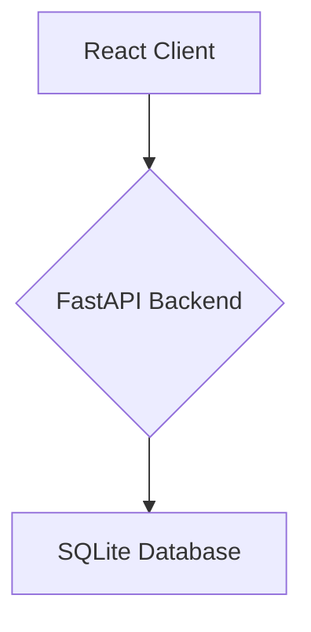
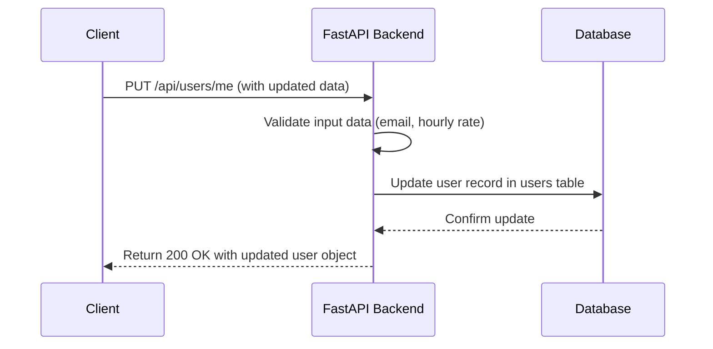

# # v0.0.2 Profile: Editable Profile View - Design Document

## Overview

This document outlines the technical design for implementing an editable profile feature. This feature will enhance the existing profile view page by allowing authenticated users to update their own account information, such as email, skills, and hourly rate. The core objective is to provide users with self-service capabilities for managing their data, thereby improving user experience and reducing the load on customer support.

-----

## Steering Document Alignment

### Technical Standards (tech_stack.md)

This design adheres to the established technical stack, utilizing a React frontend with Vite and a Python FastAPI backend. All new components and API endpoints will follow the existing coding standards, patterns, and best practices observed in the codebase.

### Project Structure (project_structure.md)

The implementation will fit into the existing project structure as follows:
-   **Frontend:** The primary changes will be within the `frontend/src/pages/Profile.jsx` component. A new API call function will be added to `frontend/src/api.js`.
-   **Backend:** A new API endpoint will be added in `backend/main.py`, and a new Pydantic schema for data validation will be created in `backend/schemas.py`.

-----

## Code Reuse Analysis

### Existing Components to Leverage

  - **[`Profile.jsx`](frontend/src/pages/Profile.jsx):** The existing profile page component will be extended to include state management for an "edit mode."
  - **[`AuthContext.jsx`](frontend/src/AuthContext.jsx):** The user data from this context will be used to populate the form fields when editing begins.
  - **[`api.js`](frontend/src/api.js):** The existing API helper will be used to make the request to the backend. A new function will be added for the update operation.

### Integration Points

  - **Existing System/API**: This feature integrates directly with the existing user authentication and data management system.
  - **Database/Storage**: The feature will update existing records in the `users` table in the `tasker.db` SQLite database.

-----

## Architecture

The architecture remains a simple client-server model. The React frontend will handle the user interface and state management, while the FastAPI backend will process the data update requests and interact with the database.



-----

## Data Flow

### Flow 1: User Updating Profile Information

This flow describes the sequence of events when a user saves their updated profile information.



-----

## API Specifications

### Endpoint 1: `PUT /api/users/me`

  - **Description**: Updates the profile information for the currently authenticated user.
  - **Request**:
      - **Headers**:
          - `Authorization`: `Bearer [JWT_TOKEN]`
          - `Content-Type`: `application/json`
      - **Body**:
        ```json
        {
          "email": "new.email@example.com",
          "skills": "React, Python, FastAPI",
          "hourly_rate": 55.0
        }
        ```
  - **Responses**:
      - **`200 OK`**: Success
        ```json
        {
          "id": 1,
          "username": "testuser",
          "email": "new.email@example.com",
          "user_type": "tasker",
          "skills": "React, Python, FastAPI",
          "hourly_rate": 55.0
        }
        ```
      - **`400 Bad Request`**: Sent if the request body fails validation (e.g., invalid email format, negative hourly rate).
        ```json
        {
          "detail": "Invalid input: Hourly rate must be a positive number."
        }
        ```
      - **`401 Unauthorized`**: Sent if the auth token is missing or invalid.

-----

## Components and Interfaces

### Component 1: `Profile.jsx`

  - **Purpose**: To display user profile information and provide an interface for editing it.
  - **Interfaces**:
    - Manages internal state for `isEditing` (boolean).
    - Renders input fields when `isEditing` is true.
    - Handles `onChange` events for form inputs.
    - Triggers API call on "Save" button click.
  - **Dependencies**: `api.js`, `AuthContext.jsx`.
  - **Reuses**: Existing layout and styling from the view-only version of the page.

-----

## Data Models

### Model 1: `UserUpdate` (Pydantic Schema)

This model will be defined in `backend/schemas.py` to validate the incoming request body.

```python
from pydantic import BaseModel, EmailStr, Field
from typing import Optional

class UserUpdate(BaseModel):
    email: Optional[EmailStr] = None
    skills: Optional[str] = None
    hourly_rate: Optional[float] = Field(None, gt=0)
```

-----

## Error Handling

### Error Scenarios

1.  **Scenario 1**: Invalid input data submitted.
      - **Handling**: The backend API will return a `400 Bad Request` response with a descriptive error message. The frontend will catch this error and display it to the user near the relevant field.
      - **User Impact**: The user sees a message like "Please enter a valid email address" and the form remains in edit mode for correction.

2.  **Scenario 2**: API server is down or unreachable.
      - **Handling**: The frontend API call will fail. A generic error message will be displayed to the user.
      - **User Impact**: The user sees a message like "Failed to save changes. Please try again later." The form remains in edit mode.

-----

## Testing Strategy

### Unit Testing
  - **Frontend**: Use Jest/React Testing Library to test the `Profile.jsx` component's state transitions between view and edit mode, and to test input handling.
  - **Backend**: Use Pytest to test the validation logic in the `UserUpdate` schema and the database update logic in the API endpoint.

### Integration Testing
  - Test the `PUT /api/users/me` endpoint to ensure it correctly validates data, updates the database, and returns the updated user object.

### End-to-End Testing
  - Use a tool like Cypress to simulate the full user journey:
    1. User logs in.
    2. Navigates to the profile page.
    3. Clicks "Edit".
    4. Changes their email and hourly rate.
    5. Clicks "Save".
    6. Verifies that the new information is displayed on the page.