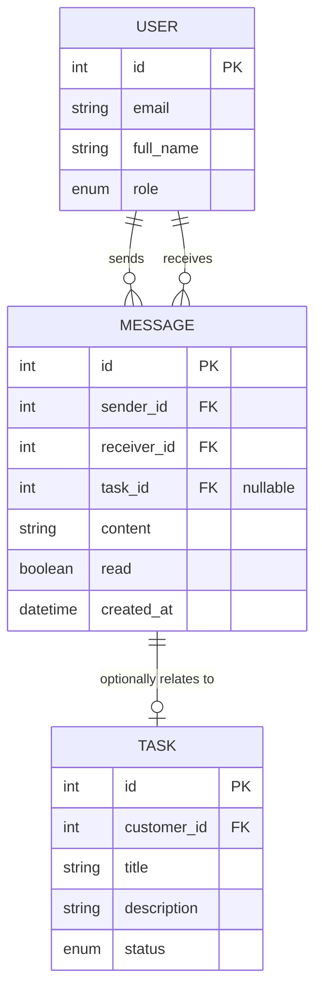
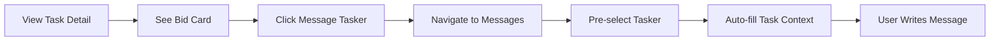
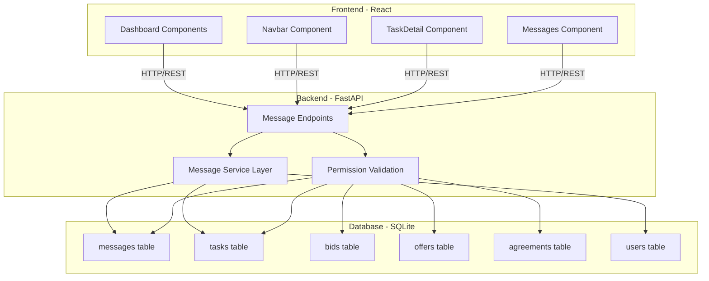
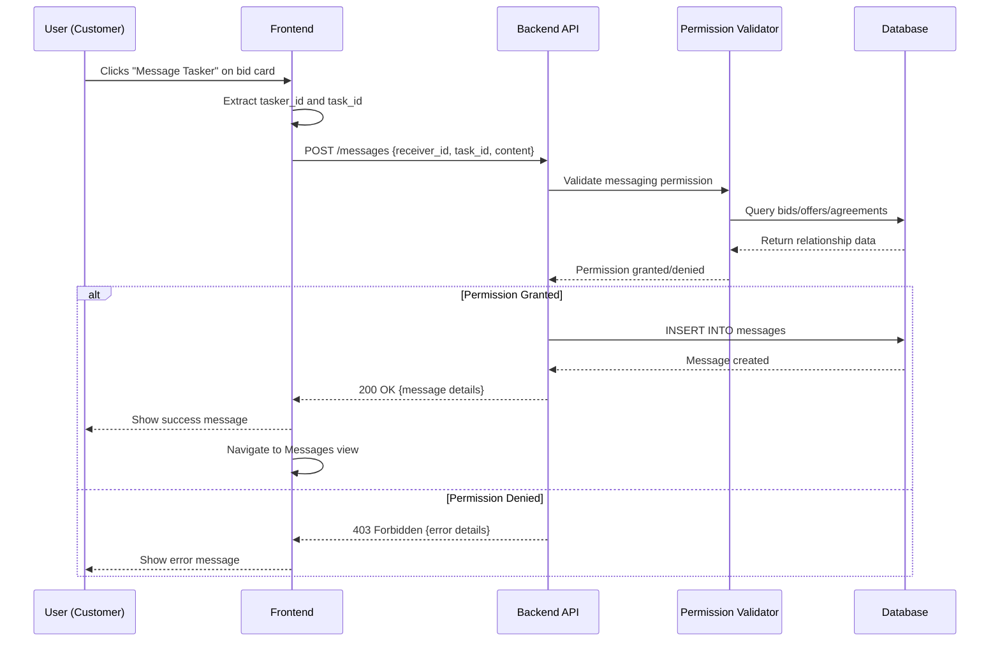

# v0.0.1 Messaging System - User Stories

## Overview

This document contains detailed user stories for the Messaging System feature in version 0.0.1 of the Tasker Platform. The Messaging System enables bidirectional communication between customers and taskers throughout the task lifecycle, from pre-agreement inquiries through post-agreement coordination. This feature enhances the existing basic messaging implementation with task context, permission controls, and improved user experience to create a complete end-to-end communication solution within the platform.

---

## Story Summary

| Story ID | Epic | Title | Story Points | Priority |
| :--- | :--- | :--- | :--- | :--- |
| v0.0.1-1-1 | Epic 1 | Messaging Permission Validation System | 8 | High |
| v0.0.1-1-2 | Epic 1 | Task Context for Messages | 5 | High |
| v0.0.1-2-1 | Epic 2 | Enhanced Message List with User Details | 5 | High |
| v0.0.1-2-2 | Epic 2 | Message Tasker Button Integration | 3 | High |
| v0.0.1-2-3 | Epic 2 | Unread Message Indicators | 3 | Medium |
| v0.0.1-2-4 | Epic 2 | Task-Filtered Message View | 5 | Medium |
| v0.0.1-3-1 | Epic 3 | Pre-Agreement Messaging for Bids | 5 | High |
| v0.0.1-3-2 | Epic 3 | Pre-Agreement Messaging for Offers | 5 | High |
| v0.0.1-3-3 | Epic 3 | Post-Agreement Messaging | 3 | Medium |
| v0.0.1-3-4 | Epic 3 | Message Polling System | 3 | Low |

---

## Epic 1: Message Permissions & Context

### Story v0.0.1-1-1: Messaging Permission Validation System

**User Story:**
As a platform administrator  
I want the system to validate messaging permissions based on task relationships  
So that users can only message appropriate parties and maintain platform security

**Acceptance Criteria (Gherkin Format):**

**Scenario 1: Customer messages tasker with bid**
**Given** a customer has a task with one or more bids  
**When** the customer attempts to send a message to a tasker  
**Then** the system should validate that the tasker has an active bid on any of the customer's tasks  
**And** allow the message if validation passes  
**And** reject the message with a 403 error if validation fails

**Scenario 2: Tasker messages customer with bid**
**Given** a tasker has placed a bid on a customer's task  
**When** the tasker attempts to send a message to the customer  
**Then** the system should validate that the tasker has an active bid on one of the customer's tasks  
**And** allow the message if validation passes  
**And** reject the message with a 403 error if validation fails

**Scenario 3: Customer messages tasker with offer**
**Given** a customer has sent an offer to a tasker  
**When** the customer attempts to send a message to the tasker  
**Then** the system should validate that the customer has sent an offer to this tasker  
**And** allow the message if validation passes  
**And** reject the message with a 403 error if validation fails

**Scenario 4: Agreement-based messaging**
**Given** a customer and tasker have an active agreement  
**When** either party attempts to send a message to the other  
**Then** the system should validate the agreement exists  
**And** allow the message if validation passes  
**And** reject the message with a 403 error if validation fails

**Detailed Acceptance Criteria:**
- Backend must implement a permission validation function that checks bid, offer, and agreement relationships
- Validation must occur before message creation in the database
- Error responses must include clear messaging about why permission was denied
- Validation logic must handle all relationship types: bids, offers, and agreements
- Performance: Validation queries must complete in under 100ms
- The validation function must be reusable across different message creation endpoints
- Security: User ID from JWT token must be used for validation, not request body
- Edge case: If a task has multiple bids from the same tasker, validation should still pass

**Definition of Done:**
- [ ] Permission validation function implemented in [`auth.py`](../../app/backend/auth.py) or new `permissions.py` module
- [ ] Validation integrated into message creation endpoint in [`main.py`](../../app/backend/main.py)
- [ ] Unit tests written covering all four validation scenarios (>90% coverage)
- [ ] Integration tests verify rejection of unauthorized messaging attempts
- [ ] Error responses return appropriate HTTP status codes (403 Forbidden)
- [ ] Error messages are user-friendly and informative
- [ ] Code reviewed and approved by at least one peer
- [ ] Documentation added for the permission validation logic

**Technical Implementation Notes:**

```python
# Permission validation function structure
def can_message_user(db: Session, sender_id: int, receiver_id: int, sender_role: UserRole) -> bool:
    # Check for active agreements
    # Check for bids (tasker → customer or customer → tasker with bid)
    # Check for offers (customer → tasker or tasker → customer with offer)
    # Return True if any relationship exists, False otherwise
```

**Database Queries Needed:**
- Query for agreements between sender and receiver
- Query for bids where sender is customer and receiver is tasker (or vice versa)
- Query for offers where sender is customer and receiver is tasker (or vice versa)

---

### Story v0.0.1-1-2: Task Context for Messages

**User Story:**
As a user  
I want messages to be associated with specific tasks  
So that I can understand which task a conversation relates to when managing multiple discussions

**Acceptance Criteria (Gherkin Format):**

**Given** a user is sending a message related to a specific task  
**When** they create the message  
**Then** the system should store the task_id with the message  
**And** display the task title and details in the message context  
**And** allow filtering messages by task

**Detailed Acceptance Criteria:**
- Message schema already includes optional `task_id` field - ensure it's properly utilized
- Backend API must accept `task_id` in message creation requests
- When `task_id` is provided, validate that the task exists and sender has permission to discuss it
- Message response schema must include task details (title, status) when task_id is present
- Frontend must display task context in message threads when available
- Task context must be displayed as a header or badge in the message view
- Messages without task context (general messages) should still be supported
- Performance: JOIN queries to fetch task details must not slow down message loading

**Definition of Done:**
- [ ] Backend message creation endpoint accepts and validates `task_id` parameter
- [ ] Message response schema enhanced to include task details using SQLAlchemy relationships
- [ ] Database query optimized with proper JOINs for task information
- [ ] Frontend Messages component displays task context in conversation view
- [ ] Task validation ensures user has permission to message about that specific task
- [ ] Unit tests cover task association logic (>90% coverage)
- [ ] Integration tests verify task context flows from creation to display
- [ ] Performance benchmark confirms no significant degradation (<50ms increase)
- [ ] Code reviewed and approved by at least one peer

**Data Model Changes:**

```python
# Enhanced MessageResponse schema
class MessageResponseWithTask(MessageResponse):
    task_title: Optional[str] = None
    task_status: Optional[TaskStatus] = None
    
    class Config:
        from_attributes = True
```

**Mermaid Diagram: Message-Task Relationship**



---

## Epic 2: Enhanced Messaging UI

### Story v0.0.1-2-1: Enhanced Message List with User Details

**User Story:**
As a user  
I want to see the names and roles of people I'm messaging with  
So that I can easily identify conversation partners instead of just seeing user IDs

**Acceptance Criteria (Gherkin Format):**

**Given** a user is viewing their message list  
**When** the message list loads  
**Then** each conversation should display the other user's full name  
**And** display the other user's role (customer/tasker)  
**And** show the last message preview  
**And** display the timestamp of the last message

**Detailed Acceptance Criteria:**
- Replace "User {userId}" display with actual user full names from the database
- Add visual indicators for user roles (e.g., badge or icon for customer/tasker)
- Last message preview should truncate at 50 characters with ellipsis
- Timestamp should be in relative format (e.g., "2 hours ago") for recent messages
- Timestamp should show full date/time for messages older than 24 hours
- User avatars or initials should be displayed (optional enhancement)
- Conversation list should be sorted by most recent message first
- Performance: User details must be fetched efficiently (single query with JOINs)

**Definition of Done:**
- [ ] Backend API enhanced to return user details (full_name, role) with messages
- [ ] Frontend Messages component updated to display user names instead of IDs
- [ ] Role badges implemented with appropriate styling
- [ ] Timestamp formatting implemented with relative and absolute formats
- [ ] Conversation sorting by most recent message implemented
- [ ] CSS styling matches the platform's design system
- [ ] Component works correctly with empty state (no messages)
- [ ] Unit tests for conversation list rendering (>85% coverage)
- [ ] Visual regression tests confirm UI matches design specifications
- [ ] Code reviewed and approved by at least one peer
- [ ] Accessibility verified (screen reader compatible, keyboard navigation)

**Frontend Component Changes:**

```javascript
// Enhanced conversation display
<div className="conversation-item">
  <div className="user-info">
    <span className="user-name">{otherUser.full_name}</span>
    <span className={`role-badge ${otherUser.role}`}>
      {otherUser.role}
    </span>
  </div>
  <p className="last-message">{lastMessage.content}</p>
  <span className="timestamp">{formatTimestamp(lastMessage.created_at)}</span>
</div>
```

**Backend API Enhancement:**

```python
# Enhanced message retrieval with user details
@app.get("/messages", response_model=List[MessageResponseWithUser])
async def get_messages(current_user: User = Depends(get_current_user)):
    # Use JOIN to fetch sender/receiver details
    # Return enriched message data including user full_name and role
```

---

### Story v0.0.1-2-2: Message Tasker Button Integration

**User Story:**
As a customer viewing a task with bids or offers  
I want a prominent "Message Tasker" button  
So that I can easily initiate conversations without navigating away from the task details

**Acceptance Criteria (Gherkin Format):**

**Given** a customer is viewing a task detail page  
**When** the task has one or more bids  
**Then** each bid card should display a "Message Tasker" button  
**And** clicking the button should open the messaging interface with that tasker pre-selected  
**And** the task context should be automatically associated with the new conversation

**Given** a customer is viewing a task detail page  
**When** the task has offers they've sent  
**Then** each offer card should display a "Message Tasker" button  
**And** clicking the button should open the messaging interface with that tasker pre-selected

**Detailed Acceptance Criteria:**
- "Message Tasker" button must be clearly visible on bid and offer cards
- Button should use primary action styling (prominent, accessible)
- Clicking button navigates to Messages view with conversation pre-selected
- If no prior conversation exists, create new conversation with pre-populated task context
- Button must be disabled for taskers viewing their own bids (no self-messaging)
- Navigation should preserve task_id in the message creation context
- Button should show loading state while navigating/initializing conversation
- Keyboard navigation must work (Enter key activates button)

**Definition of Done:**
- [ ] "Message Tasker" button added to bid cards in TaskDetail component
- [ ] "Message Tasker" button added to offer cards in TaskDetail component
- [ ] Button click handler implemented to navigate to Messages with pre-selected user
- [ ] Task context automatically passed to message composition
- [ ] Self-messaging prevented (button hidden/disabled appropriately)
- [ ] Loading states implemented for async navigation
- [ ] CSS styling matches design system (primary action button)
- [ ] Unit tests for button rendering and click handling (>85% coverage)
- [ ] Integration tests verify navigation flow and context preservation
- [ ] Accessibility verified (WCAG 2.1 AA compliant)
- [ ] Code reviewed and approved by at least one peer

**UI/UX Flow:**



---

### Story v0.0.1-2-3: Unread Message Indicators

**User Story:**
As a user  
I want to see unread message counts in my navigation and conversation list  
So that I can prioritize which conversations need my attention

**Acceptance Criteria (Gherkin Format):**

**Given** a user has unread messages  
**When** they view the main navigation  
**Then** a badge should display the total count of unread messages next to the Messages link  
**And** the badge should be visually distinct (e.g., red background with white text)

**Given** a user is viewing their conversation list  
**When** a conversation has unread messages  
**Then** an unread count badge should appear next to that conversation  
**And** the conversation should be visually highlighted (e.g., bold text or different background)

**Given** a user opens a conversation with unread messages  
**When** the conversation loads  
**Then** all unread messages should be automatically marked as read  
**And** the unread count should update immediately

**Detailed Acceptance Criteria:**
- Main navigation badge shows total unread count across all conversations
- Badge automatically updates when new messages arrive (via polling)
- Conversation-level badges show unread count per conversation partner
- Unread messages are marked as read when conversation is opened (existing functionality)
- Visual indicators must be accessible (sufficient color contrast, not relying solely on color)
- Zero unread state should hide badges (not display "0")
- Badge should display "99+" for counts over 99
- Performance: Unread count query must be optimized (indexed read field)

**Definition of Done:**
- [ ] Backend API endpoint created to fetch unread message count
- [ ] Frontend Navbar component enhanced with unread message badge
- [ ] Conversation list displays per-conversation unread counts (already partially implemented)
- [ ] Badge styling implemented with accessible color contrast
- [ ] Auto-update mechanism implemented via polling (see Story v0.0.1-3-4)
- [ ] Edge cases handled (0 unread, >99 unread)
- [ ] Unit tests for unread count calculation and display (>85% coverage)
- [ ] Integration tests verify mark-as-read functionality
- [ ] Accessibility verified (WCAG 2.1 AA compliant, screen reader announces counts)
- [ ] Code reviewed and approved by at least one peer
- [ ] Performance tested with large message datasets (>1000 messages)

**Backend API:**

```python
@app.get("/messages/unread-count")
async def get_unread_count(current_user: User = Depends(get_current_user), db: Session = Depends(get_db)):
    count = db.query(Message).filter(
        Message.receiver_id == current_user.id,
        Message.read == False
    ).count()
    return {"unread_count": count}
```

---

### Story v0.0.1-2-4: Task-Filtered Message View

**User Story:**
As a user managing multiple tasks simultaneously  
I want to filter messages by specific task  
So that I can focus on conversations relevant to a particular task without distraction

**Acceptance Criteria (Gherkin Format):**

**Given** a user is viewing the Messages component  
**When** they select a task from a filter dropdown  
**Then** only conversations related to that specific task should be displayed  
**And** the conversation list should show task context for filtered messages  
**And** the filter should persist during the session

**Given** a user has filtered messages by task  
**When** they select "All Tasks" or clear the filter  
**Then** all conversations should be displayed again  
**And** the task-specific filtering should be removed

**Detailed Acceptance Criteria:**
- Task filter dropdown must list all tasks the user is involved with (created, bid on, or has agreements for)
- Filter dropdown should show task title and status
- Tasks should be sorted by most recent activity
- Filter should update conversation list in real-time (no page refresh)
- Filter state should persist in component state during session
- Users should be able to quickly toggle between filtered and unfiltered views
- Empty state message when no conversations match the selected task filter
- Performance: Filtering should happen client-side if possible, or use efficient backend queries

**Definition of Done:**
- [ ] Task filter dropdown component implemented in Messages view
- [ ] Backend API returns task list for current user (if needed for server-side filtering)
- [ ] Filter logic implemented to show only task-specific conversations
- [ ] "All Tasks" option added to clear filter
- [ ] Empty state handling for no matching conversations
- [ ] Filter state management implemented (useState/useEffect)
- [ ] CSS styling for filter dropdown matches design system
- [ ] Unit tests for filtering logic (>85% coverage)
- [ ] Integration tests verify filter behavior with various data states
- [ ] Accessibility verified (dropdown keyboard navigable, screen reader compatible)
- [ ] Code reviewed and approved by at least one peer
- [ ] Performance tested with large conversation datasets (>50 conversations)

**User Interface Mockup:**

```
┌─────────────────────────────────────────────┐
│ Messages                                     │
├─────────────────────────────────────────────┤
│ Filter by Task: [All Tasks ▼]               │
├─────────────────────────────────────────────┤
│ Conversations         │ Message Thread      │
│ ┌──────────────────┐ │                     │
│ │ John Doe (tasker)│ │                     │
│ │ Re: Lawn Mowing  │ │                     │
│ └──────────────────┘ │                     │
└─────────────────────────────────────────────┘
```

---

## Epic 3: Task-Based Communication

### Story v0.0.1-3-1: Pre-Agreement Messaging for Bids

**User Story:**
As a customer  
I want to message taskers who have bid on my task  
So that I can ask clarifying questions before making a hiring decision

**As a tasker**
I want to message customers whose tasks I've bid on  
So that I can provide additional information about my qualifications or approach

**Acceptance Criteria (Gherkin Format):**

**Scenario 1: Customer initiates message to bidder**
**Given** a customer has a task with one or more bids  
**When** the customer sends a message to a tasker who bid on their task  
**Then** the message should be created successfully  
**And** the message should include the task_id for context  
**And** the tasker should be able to receive and reply to the message

**Scenario 2: Tasker initiates message about their bid**
**Given** a tasker has placed a bid on a customer's task  
**When** the tasker sends a message to the customer  
**Then** the message should be created successfully  
**And** the message should include the task_id for context  
**And** the customer should be able to receive and reply to the message

**Scenario 3: Unauthorized messaging attempt**
**Given** a tasker has not bid on a customer's task  
**When** the tasker attempts to message the customer about that task  
**Then** the system should reject the message with a 403 error  
**And** display an error message explaining the permission issue

**Detailed Acceptance Criteria:**
- Permission validation must verify active bid relationship before allowing message
- Messages must automatically associate with the task's task_id
- Bidders can message task creator even before bid acceptance
- Task creator can message any tasker who has placed a bid on their tasks
- Error handling must provide clear feedback for unauthorized attempts
- Message history should be preserved even if bid is later withdrawn or rejected
- UI must make it clear which task the conversation relates to
- Multiple bids from same tasker on different tasks should create separate conversations per task

**Definition of Done:**
- [ ] Permission validation integrated for bid-based messaging (uses v0.0.1-1-1)
- [ ] Backend API endpoint handles bid relationship validation
- [ ] Task context automatically added to messages initiated from bid cards
- [ ] Frontend "Message Tasker" button implemented on bid cards (uses v0.0.1-2-2)
- [ ] Error handling implemented for unauthorized messaging attempts
- [ ] Unit tests cover bid-based permission scenarios (>90% coverage)
- [ ] Integration tests verify full message flow from bid to message delivery
- [ ] Edge cases tested (withdrawn bids, multiple bids, same user different tasks)
- [ ] Code reviewed and approved by at least one peer
- [ ] User acceptance testing confirms workflow meets requirements

**Integration Points:**
- Depends on: v0.0.1-1-1 (Permission Validation System)
- Depends on: v0.0.1-2-2 (Message Tasker Button Integration)
- Depends on: v0.0.1-1-2 (Task Context for Messages)

---

### Story v0.0.1-3-2: Pre-Agreement Messaging for Offers

**User Story:**
As a customer  
I want to message taskers I've sent offers to  
So that I can communicate expectations and answer their questions before they accept

**As a tasker**
I want to message customers who have sent me offers  
So that I can ask clarifying questions before accepting the offer

**Acceptance Criteria (Gherkin Format):**

**Scenario 1: Customer messages offer recipient**
**Given** a customer has sent an offer to a tasker  
**When** the customer sends a message to the tasker  
**Then** the message should be created successfully  
**And** the message should include the task_id for context  
**And** the tasker should be able to receive and reply to the message

**Scenario 2: Tasker messages offer sender**
**Given** a tasker has received an offer from a customer  
**When** the tasker sends a message to the customer  
**Then** the message should be created successfully  
**And** the message should include the task_id for context  
**And** the customer should be able to receive and reply to the message

**Scenario 3: Unauthorized messaging attempt**
**Given** a customer has not sent an offer to a tasker  
**When** the customer attempts to message the tasker about that task  
**Then** the system should reject the message with a 403 error  
**And** display an error message explaining the permission issue

**Detailed Acceptance Criteria:**
- Permission validation must verify active offer relationship before allowing message
- Messages must automatically associate with the task's task_id
- Offer recipients can message offer sender even before accepting
- Offer sender can message recipient to discuss terms
- Error handling must provide clear feedback for unauthorized attempts
- Message history should be preserved even if offer is declined
- UI must make it clear which task and offer the conversation relates to
- Multiple offers to different taskers should create separate conversations per offer

**Definition of Done:**
- [ ] Permission validation integrated for offer-based messaging (uses v0.0.1-1-1)
- [ ] Backend API endpoint handles offer relationship validation
- [ ] Task context automatically added to messages initiated from offer cards
- [ ] Frontend "Message Tasker" button implemented on offer cards (uses v0.0.1-2-2)
- [ ] Error handling implemented for unauthorized messaging attempts
- [ ] Unit tests cover offer-based permission scenarios (>90% coverage)
- [ ] Integration tests verify full message flow from offer to message delivery
- [ ] Edge cases tested (declined offers, multiple offers, same user different tasks)
- [ ] Code reviewed and approved by at least one peer
- [ ] User acceptance testing confirms workflow meets requirements

**Integration Points:**
- Depends on: v0.0.1-1-1 (Permission Validation System)
- Depends on: v0.0.1-2-2 (Message Tasker Button Integration)
- Depends on: v0.0.1-1-2 (Task Context for Messages)

---

### Story v0.0.1-3-3: Post-Agreement Messaging

**User Story:**
As a customer with an active agreement  
I want to message the assigned tasker  
So that I can coordinate logistics, share details, and answer questions during task execution

**As a tasker with an active agreement**
I want to message the customer  
So that I can ask clarifying questions, provide updates, and coordinate task completion details

**Acceptance Criteria (Gherkin Format):**

**Given** a customer and tasker have an active agreement  
**When** either party sends a message to the other  
**Then** the message should be created successfully  
**And** the message should include the task_id for context  
**And** the message should be received and viewable by the recipient

**Given** an agreement has been completed  
**When** either party attempts to send a message  
**Then** the message should still be allowed  
**And** past conversation history should remain accessible

**Detailed Acceptance Criteria:**
- Permission validation must verify active or completed agreement before allowing message
- Agreement-based messaging should work for agreements in any status (pending, accepted, completed)
- Messages must automatically associate with the agreement's task_id
- Both parties have equal messaging rights once agreement exists
- Message history should persist even after agreement completion
- UI should clearly indicate that messaging is about an active agreement
- Dashboard should provide quick access to message the tasker/customer for active agreements
- Performance: Agreement validation query must be optimized (indexed lookups)

**Definition of Done:**
- [ ] Permission validation integrated for agreement-based messaging (uses v0.0.1-1-1)
- [ ] Backend API endpoint handles agreement relationship validation
- [ ] Task context automatically added to agreement-related messages
- [ ] Frontend integration points added to agreement management UI
- [ ] Message access preserved for completed agreements
- [ ] Unit tests cover agreement-based permission scenarios (>90% coverage)
- [ ] Integration tests verify full message flow for all agreement statuses
- [ ] Edge cases tested (pending vs accepted vs completed agreements)
- [ ] Code reviewed and approved by at least one peer
- [ ] User acceptance testing confirms workflow meets requirements

**Agreement Status Handling:**

```python
# Agreement-based messaging permission check
def has_agreement_relationship(db: Session, user1_id: int, user2_id: int) -> bool:
    agreement = db.query(Agreement).join(Task).filter(
        or_(
            and_(Task.customer_id == user1_id, Agreement.tasker_id == user2_id),
            and_(Task.customer_id == user2_id, Agreement.tasker_id == user1_id)
        )
    ).first()
    return agreement is not None
```

**Integration Points:**
- Depends on: v0.0.1-1-1 (Permission Validation System)
- Depends on: v0.0.1-1-2 (Task Context for Messages)
- Enhances: Agreement management UI in dashboards

---

### Story v0.0.1-3-4: Message Polling System

**User Story:**
As a user  
I want to see new messages appear automatically without manual refresh  
So that I can have near-real-time conversations with other users

**Acceptance Criteria (Gherkin Format):**

**Given** a user is viewing the Messages component  
**When** new messages are sent to them  
**Then** the messages should appear in the conversation within 10 seconds  
**And** the unread count should update automatically  
**And** the conversation list should resort if needed

**Given** a user is viewing a conversation  
**When** the other party sends a message  
**Then** the new message should appear in the thread within 10 seconds  
**And** the message should be automatically marked as read

**Detailed Acceptance Criteria:**
- Implement polling mechanism that fetches new messages every 5-10 seconds
- Polling should only occur when Messages component is mounted
- Polling should pause when browser tab is not active (to conserve resources)
- New messages should be smoothly inserted into conversation without jarring UI jumps
- Scroll position should be preserved when new messages arrive (unless user is at bottom)
- If user is at bottom of conversation, auto-scroll to show new message
- Polling should handle error states gracefully (network failures, API errors)
- Performance: Polling requests should use conditional queries (e.g., fetch messages after last_message_id)
- Memory: Cleanup polling intervals when component unmounts to prevent memory leaks

**Definition of Done:**
- [ ] Polling mechanism implemented using setInterval in Messages component
- [ ] Polling interval configurable (default 5 seconds)
- [ ] Tab visibility detection implemented (pause when tab inactive)
- [ ] Conditional queries implemented to fetch only new messages
- [ ] UI smoothly handles new message insertion without layout shift
- [ ] Scroll behavior implemented (preserve position or auto-scroll)
- [ ] Error handling for network failures and API errors
- [ ] Memory leak prevention (cleanup intervals on unmount)
- [ ] Unit tests for polling logic and edge cases (>85% coverage)
- [ ] Integration tests verify real-time behavior across multiple sessions
- [ ] Performance tested under high message volume (>100 messages/conversation)
- [ ] Code reviewed and approved by at least one peer
- [ ] Accessibility verified (screen reader announces new messages)

**Polling Implementation:**

```javascript
useEffect(() => {
  const interval = setInterval(() => {
    if (document.visibilityState === 'visible') {
      loadMessages();
    }
  }, 5000); // Poll every 5 seconds

  return () => clearInterval(interval); // Cleanup on unmount
}, []);
```

**Future Consideration:**
- This polling approach is suitable for MVP but should be replaced with WebSocket implementation for production to reduce server load and provide true real-time updates

---

## Story Dependencies

### Critical Path

The following stories must be completed in sequence as they build on each other:

1. **Foundation Layer (Must complete first):**
   - v0.0.1-1-1 (Messaging Permission Validation System) → v0.0.1-1-2 (Task Context for Messages)

2. **Pre-Agreement Communication (Parallel after foundation):**
   - v0.0.1-3-1 (Pre-Agreement Messaging for Bids)
   - v0.0.1-3-2 (Pre-Agreement Messaging for Offers)

3. **UI Enhancement Layer (Can start after v0.0.1-1-2):**
   - v0.0.1-2-1 (Enhanced Message List) → v0.0.1-2-2 (Message Tasker Button) → v0.0.1-2-3 (Unread Indicators) → v0.0.1-2-4 (Task-Filtered View)

4. **Post-Agreement & Polish (After pre-agreement stories):**
   - v0.0.1-3-3 (Post-Agreement Messaging)
   - v0.0.1-3-4 (Message Polling System) - Can be done in parallel

### Parallel Development Opportunities

The following groups of stories can be developed concurrently by different team members:

**Stream 1: Backend Permission & Context (Epic 1)**
- Developer A can work on v0.0.1-1-1 and v0.0.1-1-2 sequentially
- Critical foundation for all other stories
- Estimated timeline: 2-3 sprints

**Stream 2: Frontend UI Enhancements (Epic 2)**
- Developer B can work on v0.0.1-2-1 (after v0.0.1-1-2 is complete)
- Then continue with v0.0.1-2-2, v0.0.1-2-3, v0.0.1-2-4 sequentially
- Requires task context from Epic 1 before starting
- Estimated timeline: 2-3 sprints

**Stream 3: Communication Workflows (Epic 3)**
- Developer C can work on v0.0.1-3-1 and v0.0.1-3-2 in parallel (after v0.0.1-1-1 is complete)
- Both stories have similar implementation patterns
- Can be developed by the same developer or split between two developers
- Estimated timeline: 1-2 sprints

**Stream 4: Post-Agreement & Polish**
- Developer D can work on v0.0.1-3-3 after agreement stories are complete
- v0.0.1-3-4 (Polling) can be developed independently by any developer
- Estimated timeline: 1 sprint

**Recommended Team Size:** 2-3 developers
**Estimated Total Timeline:** 3-4 sprints (assuming 2-week sprints)

**Sprint Planning Suggestion:**

**Sprint 1: Foundation**
- v0.0.1-1-1 (Permission Validation) - High priority
- v0.0.1-1-2 (Task Context) - High priority
- Goal: Complete Epic 1, establish foundation for all other work

**Sprint 2: Core Communication**
- v0.0.1-2-1 (Enhanced Message List) - High priority
- v0.0.1-3-1 (Bid Messaging) - High priority
- v0.0.1-3-2 (Offer Messaging) - High priority
- Goal: Enable pre-agreement communication workflows

**Sprint 3: UI Polish & Integration**
- v0.0.1-2-2 (Message Tasker Button) - High priority
- v0.0.1-2-3 (Unread Indicators) - Medium priority
- v0.0.1-3-3 (Post-Agreement Messaging) - Medium priority
- Goal: Complete user experience, add visual polish

**Sprint 4: Advanced Features**
- v0.0.1-2-4 (Task-Filtered View) - Medium priority
- v0.0.1-3-4 (Polling System) - Low priority
- Goal: Add convenience features and real-time capabilities

---

## Technical Architecture

### System Context



### Data Flow: Sending a Message with Task Context



### Database Schema: Message Relationships

The existing database schema already supports the messaging system with the following key relationships:

**Current Schema (from [`database.py`](../../app/backend/database.py)):**

```python
class Message(Base):
    __tablename__ = "messages"
    
    id = Column(Integer, primary_key=True, index=True)
    sender_id = Column(Integer, ForeignKey("users.id"), nullable=False)
    receiver_id = Column(Integer, ForeignKey("users.id"), nullable=False)
    task_id = Column(Integer, ForeignKey("tasks.id"))  # Optional task context
    content = Column(Text, nullable=False)
    read = Column(Boolean, default=False)
    created_at = Column(DateTime, default=datetime.utcnow)
```

**Key Relationships for Permission Validation:**

1. **Bid-based messaging:** Link through `bids.task_id` and `bids.tasker_id`
2. **Offer-based messaging:** Link through `offers.task_id`, `offers.customer_id`, and `offers.tasker_id`
3. **Agreement-based messaging:** Link through `agreements.task_id` and `agreements.tasker_id`

**No schema changes required** - the existing structure supports all messaging features.

---

## API Endpoints

### New Endpoints Required

**1. Get Unread Message Count**
```
GET /messages/unread-count
Response: {"unread_count": 5}
```

**2. Enhanced Get Messages with User Details**
```
GET /messages
Response: [
  {
    "id": 1,
    "sender_id": 2,
    "sender_name": "John Doe",
    "sender_role": "tasker",
    "receiver_id": 1,
    "receiver_name": "Jane Smith",
    "receiver_role": "customer",
    "task_id": 10,
    "task_title": "Lawn Mowing Service",
    "task_status": "open",
    "content": "I'd be happy to help...",
    "read": false,
    "created_at": "2025-11-05T14:30:00Z"
  }
]
```

**3. Get User's Tasks (for filter dropdown)**
```
GET /tasks/my-tasks
Response: [
  {
    "id": 10,
    "title": "Lawn Mowing Service",
    "status": "open",
    "has_unread_messages": true
  }
]
```

### Enhanced Endpoints

**1. POST /messages - Enhanced with permission validation**
```
Request: {
  "receiver_id": 2,
  "task_id": 10,  // Optional but recommended
  "content": "Hello, I have a question about..."
}
Response: 201 Created or 403 Forbidden
```

**2. POST /messages/mark-read/{message_id} - Already exists**
```
No changes needed - existing implementation is sufficient
```

---

## Testing Strategy

### Unit Testing

**Backend Tests (pytest) - Target Coverage: 90%+**

**Permission Validation Tests (`test_permissions.py`):**
```python
def test_can_message_with_active_bid():
    # Customer can message tasker who bid on their task
    
def test_can_message_with_active_offer():
    # Customer can message tasker they sent offer to
    
def test_can_message_with_active_agreement():
    # Both parties can message with active agreement
    
def test_cannot_message_without_relationship():
    # Returns False for users with no relationship
    
def test_cannot_message_after_bid_withdrawal():
    # Edge case: bid withdrawn but messages remain accessible
    
def test_multiple_bids_same_tasker():
    # Tasker with multiple bids can message about any
    
def test_completed_agreement_messaging():
    # Messaging allowed even after agreement completion
```

**Message Creation Tests (`test_messages.py`):**
```python
def test_create_message_with_task_context():
    # Message created with valid task_id
    
def test_create_message_without_task_context():
    # Message created without task_id (general message)
    
def test_message_task_validation():
    # Invalid task_id rejected
    
def test_message_permission_validation():
    # Unauthorized messaging attempt rejected with 403
    
def test_message_content_validation():
    # Empty content rejected
    # Content max length enforced (if applicable)
```

**Message Retrieval Tests (`test_message_retrieval.py`):**
```python
def test_get_messages_with_user_details():
    # Returns enriched message data with sender/receiver names and roles
    
def test_get_messages_ordered_by_timestamp():
    # Messages returned in chronological order
    
def test_get_unread_count():
    # Accurate unread count returned
    
def test_get_messages_filtered_by_task():
    # Only messages for specific task returned
    
def test_get_conversations_grouped_correctly():
    # Messages grouped by conversation partner
```

**Mark as Read Tests (`test_mark_read.py`):**
```python
def test_mark_message_as_read():
    # Message read status updated successfully
    
def test_mark_read_updates_unread_count():
    # Unread count decrements after marking as read
    
def test_cannot_mark_others_message_as_read():
    # User can only mark their own received messages as read
    
def test_mark_already_read_message():
    # Idempotent operation - no error on re-marking
```

**Frontend Tests (Jest/React Testing Library) - Target Coverage: 85%+**

**Messages Component Tests (`Messages.test.js`):**
```javascript
describe('Messages Component', () => {
  test('renders empty state when no conversations', () => {
    // Shows "No messages yet" when conversations empty
  });
  
  test('renders conversation list with user details', () => {
    // Displays user names, not IDs
    // Shows role badges (customer/tasker)
  });
  
  test('displays unread count badges correctly', () => {
    // Shows unread count for conversations with unread messages
    // Hides badge when count is 0
  });
  
  test('selects conversation on click', () => {
    // Conversation highlighted when selected
    // Message thread displayed for selected conversation
  });
  
  test('sends message successfully', () => {
    // Form submission creates message
    // Success message displayed
    // Message list refreshed
  });
  
  test('handles message send error', () => {
    // Error message displayed on failure
    // Form not cleared on error
  });
  
  test('marks messages as read when conversation opened', () => {
    // Unread messages marked as read
    // Unread count updates
  });
  
  test('filters messages by task', () => {
    // Task filter dropdown populated
    // Conversation list filtered correctly
    // "All Tasks" option clears filter
  });
  
  test('polls for new messages', () => {
    // setInterval called with correct interval
    // loadMessages called periodically
    // Polling paused when tab inactive
  });
  
  test('cleanup on unmount', () => {
    // Polling interval cleared
    // No memory leaks
  });
});
```

**Message Tasker Button Tests (`TaskDetail.test.js`):**
```javascript
describe('Message Tasker Button', () => {
  test('displays button on bid cards', () => {
    // Button visible for each bid
  });
  
  test('navigates to messages on click', () => {
    // Navigation triggered
    // Correct tasker pre-selected
    // Task context preserved
  });
  
  test('button disabled for own bids', () => {
    // Taskers cannot message themselves
  });
  
  test('handles loading state', () => {
    // Shows loading indicator during navigation
  });
});
```

**Unread Badge Tests (`Navbar.test.js`):**
```javascript
describe('Unread Message Badge', () => {
  test('displays unread count', () => {
    // Badge shows correct count
  });
  
  test('hides badge when no unread messages', () => {
    // Badge not displayed when count is 0
  });
  
  test('displays 99+ for large counts', () => {
    // Shows "99+" when count > 99
  });
  
  test('updates automatically on new messages', () => {
    // Badge count increases when new message arrives
  });
});
```

### Integration Testing

**End-to-End Workflow Tests (Comprehensive Scenarios)**

**Test 1: Pre-Agreement Messaging via Bid**
```gherkin
Given a customer "Alice" has created a task "Lawn Mowing"
And a tasker "Bob" has placed a bid of $50 on the task
When Bob clicks "Message Tasker" button on Alice's task
Then Bob should be redirected to Messages view
And the conversation with Alice should be pre-selected
And the task context "Lawn Mowing" should be displayed
When Bob sends message "I can start tomorrow"
Then the message should be created successfully
And Alice should see unread count increase to 1
When Alice opens the conversation
Then the message should be marked as read
And Alice should be able to reply
```

**Test 2: Pre-Agreement Messaging via Offer**
```gherkin
Given a customer "Alice" has created a task "Lawn Mowing"
And Alice has sent an offer of $45 to tasker "Charlie"
When Alice clicks "Message Tasker" on the offer card
Then Alice should navigate to Messages with Charlie pre-selected
When Alice sends "Can you start this weekend?"
And Charlie receives the message
Then Charlie should be able to reply
And both parties should see task context in the conversation
```

**Test 3: Post-Agreement Messaging**
```gherkin
Given Alice and Bob have an active agreement for "Lawn Mowing"
When either party sends a message
Then the message should be delivered successfully
And task context should be automatically associated
When the agreement is completed
Then both parties should still be able to message
And message history should remain accessible
```

**Test 4: Permission Denied Scenarios**
```gherkin
Given tasker "David" has NOT bid on Alice's task
When David attempts to message Alice about the task
Then the API should return 403 Forbidden
And an error message should explain the permission issue
And the message should not be created
```

**Test 5: Multi-Task Conversation Management**
```gherkin
Given Alice has 3 active tasks with different taskers
And each task has an active conversation
When Alice filters messages by "Lawn Mowing" task
Then only conversations related to that task should display
When Alice selects "All Tasks"
Then all 3 conversations should be visible again
```

**Test 6: Unread Count Synchronization**
```gherkin
Given Alice has 5 unread messages across 3 conversations
When Alice opens conversation with Bob (3 unread)
Then those 3 messages should be marked as read
And the unread count should decrease from 5 to 2
And the navbar badge should update immediately
```

**Test 7: Concurrent Messaging (Race Condition)**
```gherkin
Given Alice and Bob are both viewing their conversation
When Alice sends "Hello" at the same time Bob sends "Hi"
Then both messages should be created successfully
And both users should see both messages in correct order
And no messages should be lost or duplicated
```

**Test 8: Polling and Real-Time Updates**
```gherkin
Given Alice is viewing her Messages component
And polling is active (every 5 seconds)
When Bob sends a message to Alice
Then within 10 seconds, the message should appear in Alice's view
And the unread count should increment
And the conversation should resort to top of list
```

**API Integration Tests (Detailed)**

**Test Suite: Permission Validation Endpoint**
```python
def test_bid_permission_valid():
    # POST /messages with valid bid relationship → 201 Created
    
def test_bid_permission_invalid():
    # POST /messages without bid relationship → 403 Forbidden
    
def test_offer_permission_valid():
    # POST /messages with valid offer relationship → 201 Created
    
def test_offer_permission_invalid():
    # POST /messages without offer relationship → 403 Forbidden
    
def test_agreement_permission_valid():
    # POST /messages with active agreement → 201 Created
    
def test_mixed_permissions():
    # User with both bid and agreement can message
```

**Test Suite: Message Retrieval Endpoint**
```python
def test_get_messages_includes_user_details():
    # GET /messages returns sender/receiver names and roles
    
def test_get_messages_includes_task_context():
    # Messages with task_id include task title and status
    
def test_get_messages_pagination():
    # Large message sets paginated correctly (if implemented)
    
def test_get_messages_unauthorized():
    # Invalid JWT token → 401 Unauthorized
```

**Test Suite: Unread Count Endpoint**
```python
def test_unread_count_accurate():
    # GET /messages/unread-count returns correct count
    
def test_unread_count_after_mark_read():
    # Count decreases after marking messages as read
    
def test_unread_count_zero():
    # Returns 0 when no unread messages
    
def test_unread_count_only_own_messages():
    # Does not include messages sent by user
```

### Performance Testing

**Load Test Scenarios (Using pytest-benchmark or locust)**

**Test 1: Message Retrieval Performance**
```python
def test_message_retrieval_performance():
    # Setup: 1000 messages in database
    # Execute: GET /messages
    # Assert: Response time < 200ms for 50 messages
    # Assert: Response time < 500ms for 200 messages
```

**Test 2: Permission Validation Performance**
```python
def test_permission_validation_performance():
    # Setup: 100 bids, 50 offers, 25 agreements
    # Execute: 100 concurrent permission checks
    # Assert: Average response time < 100ms
    # Assert: 95th percentile < 150ms
```

**Test 3: Unread Count Performance**
```python
def test_unread_count_performance():
    # Setup: 10,000 messages, 500 unread
    # Execute: GET /messages/unread-count
    # Assert: Response time < 50ms
    # Monitor: Database query uses proper indexes
```

**Test 4: Polling Load Test**
```python
def test_polling_load():
    # Setup: 100 concurrent users polling every 5 seconds
    # Duration: 5 minutes of sustained load
    # Assert: No degradation in response times
    # Assert: No memory leaks on server
    # Assert: Database connection pool stable
```

**Test 5: Concurrent Message Creation**
```python
def test_concurrent_message_creation():
    # Execute: 50 users sending messages simultaneously
    # Assert: All messages created successfully
    # Assert: No database deadlocks
    # Assert: No message loss
```

**Frontend Performance Tests**

**Test 1: Conversation List Rendering**
```javascript
test('conversation list renders within 100ms', () => {
  // Setup: 20 conversations with 10 messages each
  // Measure: Initial render time
  // Assert: < 100ms
});
```

**Test 2: Message Thread Rendering**
```javascript
test('message thread renders large conversations efficiently', () => {
  // Setup: Conversation with 100 messages
  // Measure: Render time
  // Assert: < 200ms
  // Assert: Smooth scrolling maintained
});
```

**Test 3: Filter Performance**
```javascript
test('task filter applies without lag', () => {
  // Setup: 50 conversations
  // Measure: Filter application time
  // Assert: < 50ms
  // Assert: UI remains responsive
});
```

**Performance Acceptance Criteria:**
- Message retrieval: < 200ms for 50 messages, < 500ms for 200 messages
- Permission validation: < 100ms average, < 150ms 95th percentile
- Unread count: < 50ms with proper database indexing
- UI rendering: < 100ms for conversation list with 20 conversations
- Polling: Support 100+ concurrent users without degradation
- Database: Queries use appropriate indexes on `read`, `sender_id`, `receiver_id`, `task_id`

### Regression Testing

**Critical Paths to Verify After Each Change:**
1. User can log in and access Messages component
2. Existing messages display correctly
3. New messages can be sent and received
4. Permission validation prevents unauthorized messaging
5. Unread counts update correctly
6. Task context displays properly
7. Poll mechanism continues working
8. No data loss or corruption

### Test Data Requirements

**Minimum Test Dataset:**
- 5 users (3 customers, 2 taskers)
- 10 tasks (various statuses)
- 15 bids across different tasks
- 8 offers (some accepted, some pending)
- 5 active agreements
- 100+ messages (mix of read/unread, with/without task context)
- Conversations spanning all relationship types

**Edge Case Test Data:**
- Withdrawn bids with existing messages
- Declined offers with message history
- Completed agreements with ongoing conversations
- Multiple bids from same tasker on different tasks
- Tasks with no bids/offers but with messages (should not happen - test validation)

---

## Security Considerations

### Authentication & Authorization

1. **JWT Token Validation**: All message endpoints require valid JWT authentication
2. **User ID from Token**: Always use `current_user.id` from JWT, never accept user_id from request body
3. **Permission Validation**: Every message operation must validate relationships (bids/offers/agreements)
4. **SQL Injection Prevention**: Use SQLAlchemy ORM with parameterized queries (already implemented)
5. **XSS Prevention**: Sanitize message content on frontend display (use React's built-in escaping)

### Data Privacy

1. **Message Visibility**: Users can only see messages they sent or received
2. **Task Context**: Users can only see task details they have permission to access
3. **Conversation Isolation**: No cross-conversation data leakage
4. **Sensitive Information**: No password or payment information in messages

### Rate Limiting (Future Enhancement)

While not implemented in MVP, production should include:
- Message send rate: 10 messages per minute per user
- API request rate: 100 requests per minute per user
- Polling frequency: Limited to every 5 seconds minimum

---

## Accessibility Requirements

### WCAG 2.1 Level AA Compliance

**Keyboard Navigation**
- All message actions accessible via keyboard (Tab, Enter, Escape)
- Focus indicators visible on all interactive elements
- Logical tab order through conversation list and message thread

**Screen Reader Support**
- Unread message badges announced with counts
- New message alerts announced when polling detects updates
- Conversation partner names clearly announced
- Message timestamps in accessible format

**Visual Design**
- Minimum 4.5:1 color contrast for all text
- Unread indicators don't rely solely on color (use badge shape + text)
- Focus states clearly visible for keyboard users
- Message bubbles distinguishable (sent vs received)

**Responsive Design**
- Messages component works on mobile devices (320px width minimum)
- Touch targets minimum 44x44 pixels for mobile
- Scrollable conversation area with accessible overflow

---

## Monitoring & Metrics

### Key Performance Indicators (KPIs)

Track these metrics post-launch to measure feature success:

**Adoption Metrics:**
- Percentage of tasks with at least one message → Target: 40%
- Average messages per task → Target: 3-5 messages
- Daily active messaging users → Track growth trend

**Engagement Metrics:**
- Message response rate → Target: 70% within 24 hours
- Average response time → Target: < 4 hours
- Messages per active user per week → Target: 5-10

**Business Impact:**
- Agreement conversion rate (tasks with messages vs without) → Expect 20% improvement
- Agreement completion rate → Target: 85%+
- Support ticket reduction → Target: 25% reduction in contact-related tickets

**Technical Metrics:**
- Message delivery success rate → Target: 99.5%+
- Average API response time → Target: < 200ms
- Database query performance → Monitor for optimization needs

### Instrumentation

**Backend Logging:**
```python
logger.info(f"Message sent: user {sender_id} to {receiver_id}, task {task_id}")
logger.warning(f"Messaging permission denied: user {sender_id} to {receiver_id}")
logger.error(f"Message creation failed: {error_details}")
```

**Frontend Analytics:**
```javascript
analytics.track('message_sent', {
  task_id: taskId,
  conversation_partner_role: role,
  message_length: content.length
});
```

---

## Rollout Plan

### Phase 1: Internal Testing (Week 1)
- Deploy to staging environment
- Internal team testing of all workflows
- Bug fixes and refinements

### Phase 2: Beta Release (Week 2-3)
- Release to subset of users (20-30%)
- Monitor metrics and gather feedback
- Address any critical issues

### Phase 3: Full Release (Week 4)
- Roll out to 100% of users
- Announce feature via email/notifications
- Monitor adoption and engagement

### Phase 4: Optimization (Week 5+)
- Analyze usage patterns
- Optimize based on performance data
- Plan WebSocket migration for real-time updates

---

## Future Enhancements (Post-MVP)

These items are out of scope for v0.0.1 but should be considered for future releases:

1. **WebSocket Real-Time Updates**: Replace polling with WebSocket connections for true real-time messaging
2. **Message Attachments**: Allow users to share images, PDFs, and other files
3. **Rich Text Formatting**: Support bold, italic, links in messages
4. **Message Threading**: Group related messages within conversations
5. **Message Search**: Search across all conversations for specific content
6. **Read Receipts**: Show when messages have been seen
7. **Typing Indicators**: Show when the other party is typing
8. **Message Notifications**: Push notifications for new messages (web + mobile)
9. **Conversation Archiving**: Archive old conversations to reduce clutter
10. **Group Conversations**: Support more than two participants (for team tasks)
11. **Message Reactions**: Quick emoji reactions to messages
12. **Voice Messages**: Record and send audio messages
13. **Message Templates**: Pre-written responses for common questions
14. **Translation**: Auto-translate messages between languages
15. **Message Moderation**: AI-powered content moderation for safety

---

## Risks & Mitigation

### Technical Risks

**Risk 1: Polling Performance Impact**
- **Impact**: High message volume could strain server with frequent polling
- **Likelihood**: Medium
- **Mitigation**: Implement conditional queries (fetch only new messages), optimize database queries, plan WebSocket migration

**Risk 2: Permission Validation Complexity**
- **Impact**: Complex permission logic could lead to bugs or security issues
- **Likelihood**: Medium
- **Mitigation**: Comprehensive unit tests, code review, gradual rollout with monitoring

**Risk 3: Database Performance**
- **Impact**: Large message volumes could slow down queries
- **Likelihood**: Low (for MVP scale)
- **Mitigation**: Add database indexes on frequently queried fields, monitor query performance

### User Experience Risks

**Risk 1: Confusing Permissions**
- **Impact**: Users frustrated when they can't message someone they expect to
- **Likelihood**: Medium
- **Mitigation**: Clear error messages explaining why messaging isn't allowed, UI guidance

**Risk 2: Message Overload**
- **Impact**: Users overwhelmed by too many conversations
- **Likelihood**: Low
- **Mitigation**: Task filtering, unread indicators, ability to archive conversations (future)

**Risk 3: Spam/Abuse**
- **Impact**: Users send inappropriate or spam messages
- **Likelihood**: Low (MVP with limited users)
- **Mitigation**: Report functionality (future), content moderation (future), rate limiting (future)

### Business Risks

**Risk 1: Low Adoption**
- **Impact**: Feature doesn't achieve target 40% adoption rate
- **Likelihood**: Low
- **Mitigation**: Prominent UI placement, onboarding tutorials, user education

**Risk 2: Off-Platform Communication**
- **Impact**: Users share phone/email and move conversations off-platform
- **Likelihood**: Medium
- **Mitigation**: Make messaging experience so good users prefer it, consider blocking external contact sharing (future)

---

## Success Criteria

This feature will be considered successful if, within 30 days of full release:

1. ✅ **40% of tasks** have at least one message exchanged
2. ✅ **70% message response rate** within 24 hours
3. ✅ **10-15% increase** in agreement conversion rate for tasks with messages vs without
4. ✅ **25% reduction** in support tickets related to "how do I contact this tasker"
5. ✅ **4.0+ out of 5.0** user satisfaction rating for messaging feature
6. ✅ **99.5%+ message delivery** success rate
7. ✅ **< 200ms average** API response time for message operations
8. ✅ **Zero critical bugs** in production after initial 2-week stabilization period